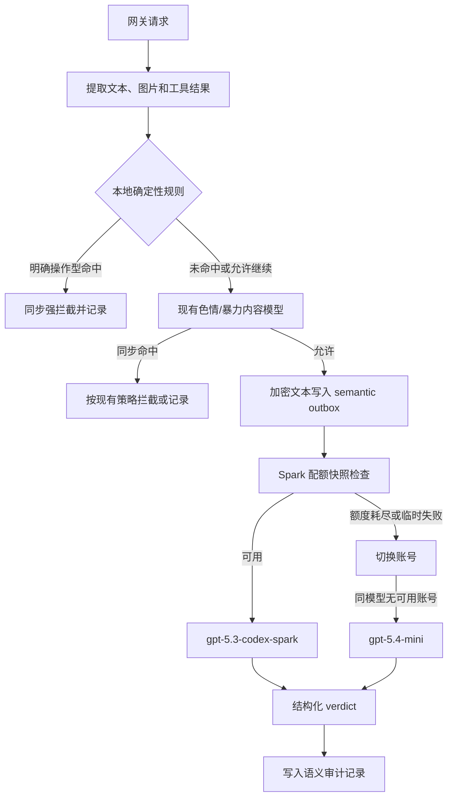

# 内容审计：规则拦截与内置模型复核

## 目标

内容审计拆成两条职责不同的链路：

1. 本地规则负责低延迟、确定性的强拦截，覆盖破限提示、越权、凭证窃取、恶意代码和明确的入侵操作。
2. 现有内容安全模型继续负责色情、暴力、自残等分类；它的结果不由语义模型替代。
3. 内置 OpenAI/Codex 账号池负责补充识别破限、逆向、凭证窃取和渗透意图。语义复核必须同时评估九个维度：意图、操作性、目标、授权、可执行性、信息访问、危害机制、证据强度和欺骗类型；可靠 outbox 负责后置复核、重试和审计落库。

后置复核发生在请求内容已经被允许之后，不能撤回已经转发给上游的请求。`pre_block` 模式下，命中本地高风险候选（cyber/jailbreak、block 动作或 high/critical 严重度）时可以进入语义模型的同步候选复核；配置 `trigger=all` 时，即使没有关键词也会对纳入范围的文本进行同步复核；`observe` 模式只做后置复核，不影响当前请求。

Prompt Injection 使用独立的同步 reviewer。启用 `prompt_injection_reviewer_enabled` 后，它不再复用通用安全分类 schema；启用 `prompt_injection_fail_closed` 时必须同时使用 `mode=pre_block`。高风险候选的 `review`、reviewer 不可用/非法响应以及 evidence 不完整均返回 503，且不计作用户违规。

## 处理流程



## 内置模型路由

默认配置如下，模型名会在服务端归一化为这两个内置模型，未知模型不会被直接发送到账号池：

```json
{
  "semantic_review": {
    "enabled": false,
    "trigger": "local_review",
    "primary_model": "gpt-5.3-codex-spark",
    "fallback_models": ["gpt-5.4-mini"],
    "timeout_ms": 15000,
    "max_input_runes": 4000,
    "prompt_injection_reviewer_enabled": false,
    "prompt_injection_max_input_runes": 12000,
    "prompt_injection_fail_closed": false
  }
}
```

Spark 账号使用仓库已有的 OpenAI 调度器。Spark 额度窗口刷新复用 `OpenAIQuotaService.QueryUsage`，读取 `/backend-api/wham/usage` 中 `additional_rate_limits.metered_feature=codex_bengalfox` 的窗口，并写回账号 `extra` 的 `codex_5h_*` / `codex_7d_*` 字段。快照缺失或超过现有 10 分钟刷新窗口时，发送审查请求前先刷新一次。

路由顺序：

- Spark 额度未耗尽：发送 Spark。
- Spark 当前账号额度耗尽：释放账号并尝试同模型的下一个账号。
- Spark 账号返回 429、5xx、临时网络错误、token/账号错误：排除当前账号，刷新其额度快照，再尝试同模型的下一个账号。
- 所有 Spark 账号都不可用：切换到 `gpt-5.4-mini`。
- 模型已经返回 `reject`：这是业务判定，不是可恢复错误，不再换模型重试，避免把同一违规内容重复发送给更多模型。
- 所有模型均不可用：outbox 按强事件策略重试，最终进入 dead letter；后置任务不会把已经放行的请求改写成历史上的同步拦截。

请求使用账号池已有的 OAuth/Codex 凭据和代理，不使用用户在聊天中提供的第三方 API key，也不把 API key 写入 outbox、日志或审计记录。

## 输入成本控制

语义模型不接收完整对话历史。候选归因和通用语义取证都只检查最新的直接 user 轮次；客户端空角色或未知角色按不可信的直接用户输入处理，同一轮拆成多个文本 part 时先合并，旧 user 历史以及 system、developer、assistant、tool/function source 不能建立当前用户意图。`local_review` 仅在该最新 user 轮次自身命中关键词或本地高风险规则时发送其关键词附近文本；上下文 source 的命中最多触发非终态审计，送审内容仍取当前直接 user 轮次。`all` 在同步 `pre_block` 路径中即使没有配置关键词也复核最新直接 user 轮次；没有当前 user 文本时，仅保留带 `context_only` 归因的协议上下文审计，不能形成用户违规。输入受每段约 1200 字符和 `max_input_runes` 总预算硬限制；只有完全缺少结构化 `Sources` 的旧协议才回退到截断后的聚合文本，有结构化 source 但当前 user 未命中时不会回退。

上述 1200 字符片段预算只适用于通用 reviewer。Prompt Injection reviewer 使用当前命中的完整 user source：12K 以内发送脱敏后的完整 source；超过 12K 时构造单个合法 JSON envelope，包含 head、命中窗口和 tail。窗口必须覆盖所有高风险 occurrence；覆盖不全、source/scan 截断或 span 无法映射时设置 `EvidenceComplete=false`，模型即使返回 `allow` 也会被收敛为 `review`。

本地 detector 同时扫描 NFKC 规范化视图与可映射的 compact 视图，识别零宽、全角、大小写和空白/标点拆分；重复 occurrence 只增加证据，不重复累计规则分数。完整规范化 source 的 keyed HMAC、policy/model route、instructions/schema/evidence revision 均参与 V4 cache key，避免相同前 2K、不同危险尾部复用旧 allow。

## Prompt Injection 专用结构化结果

```json
{
  "verdict": "allow|review|reject",
  "active_override": true,
  "presentation": "direct_instruction|quoted_analysis|benign_discussion|unknown",
  "targets": ["system", "developer", "tool", "policy", "model"],
  "confidence": 0.94,
  "reason_codes": ["hierarchy_override"]
}
```

解析器要求单个、无 Markdown 包裹、无额外字段的严格 JSON。审核器先识别外层用户任务；rollout、日志、对话转录、工具输出、技能定义和系统/开发者提示摘录在分析、总结、翻译或防御性审阅任务中视为数据，不因其中包含命令式文本而自动构成 active override。只有 `active_override=true`、`presentation=direct_instruction|prompt_authoring` 且置信度不低于 0.70 时才能确定性收敛为 `reject`；`active_override=false` 或 `presentation=quoted_analysis|translation` 与 `reject` 冲突。evidence 不完整时统一收敛为 `review`，只有 complete evidence 的 `allow` 才能放行。

## 执行凭据

每次实际进入上游前的 HTTP 请求或 WebSocket `response.create` 帧必须产生不含原文的 receipt：`RequestID`、`Protocol`、`PolicyRevision`、`LocalScanDone`、`SemanticCalled`、`Outcome`、`ForwardAllowed`。no-hit 只写轻量 receipt，不调用 reviewer、不写完整审核记录。forward adapter 发现 receipt 缺失、未完成或不可转发时立即停止并增加固定低基数冲突指标。

## 结构化结果

模型只允许返回以下 JSON 结构：

```json
{
  "verdict": "allow|review|reject",
  "intent": "benign|defensive|harmful|ambiguous",
  "target": "none|self_owned|authorized_lab|third_party|external_service|unknown",
  "authorization": "authorized|unauthorized|unclear|not_applicable",
  "information_access": "public|provided_by_user|private|restricted|unknown|not_applicable",
  "harm_mechanism": "none|unauthorized_access|credential_theft|malware|exploit_delivery|evasion|deception_fraud|market_manipulation|privacy_invasion|physical_harm|sexual_exploitation|self_harm|other",
  "harm_evidence": "none|inferred|explicit",
  "deception_type": "none|impersonation|unauthorized_submission|falsification|financial_fraud",
  "categories": ["jailbreak", "credential_theft"],
  "severity": "low|medium|high|critical",
  "confidence": 0.0,
  "operationality": "none|conceptual|actionable",
  "executability": "none|indirect|direct",
  "reason_codes": ["actionable_bypass_request"]
}
```

- `allow`：良性、防御性、教育性、已授权实验室或非操作性内容。
- `review`：仅当一个无法消除的安全关键事实会使合理解释分别落到 `allow` 与 `reject` 时，写入待人工复核记录；低置信度、轻微歧义、错别字、口语、省略、陌生词或非关键上下文缺失不能单独触发。
- `reject`：明确的恶意意图，同时具有可操作细节、直接可执行性或"剩余步骤仅为简单组装"的间接可执行性（`executability=direct|indirect`）和具体危害机制；访问受保护资源时还要求明确未授权且目标为第三方或外部服务。同步候选复核场景按配置拦截，后置场景只影响审计和后续风控。

网关还会对模型结果做确定性收敛：当结果包含 `intent=harmful`、`operationality=actionable`、`executability=direct|indirect`（indirect 指剩余步骤仅为对已提供组件的简单组装）、具体危害机制，且满足以下两个授权分支之一时，即使模型原始 verdict 是 `allow` 或 `review`，也升级为 `reject`：一是 `authorization=unauthorized` 并且目标为 `third_party|external_service`；二是 `authorization=not_applicable`、目标非 `self_owned|authorized_lab` 且 categories 命中高风险类别（含 `market_manipulation`）。授权的自有系统、隔离实验室和 CTF 不因关键词单独命中而自动升级；模型原始 verdict 为 `allow` 时，若 `intent=benign|defensive`、`authorization=authorized` 且目标为 `self_owned|authorized_lab`，允许携带非 `none` 的 `harm_mechanism`（授权实验室/自有目标豁免），不再被 `semantic_policy_allow_inconsistent` 翻为 `review`；该豁免仅作用于模型自身的 `allow`，模型的 `review`/`reject` 仍走严格一致性检查。反方向的无害收敛：当 `intent=benign|defensive` 且 `harm_mechanism=none` 时，除非模型明确给出 `authorization=unauthorized`，一律收敛为 `allow`；`authorization=unclear` 不再单独保留 `review`，模型原始的 `review` 会被降级为 `allow` 并记录 `semantic_policy_harmless_review`。该降级仅在证据完整时执行：候选证据被截断（evidence incomplete）时，模型的 `review` 保持 `review` 并进入人工复核。

另有一个范围严格受限的恶意软件一致性例外：仅当 `intent=harmful`、`operationality=actionable`、`executability=direct`、`harm_evidence=explicit`、severity 为 `critical`、confidence 不低于 0.95、categories 包含 `malware|ransomware`，且不存在授权自有/实验室范围时，才允许在 `authorization=unclear` 或 `harm_mechanism=other` 的分类瑕疵下保持或升级 `reject`。功能性勒索软件、隐蔽监视或截取私人通信、篡改协议绕过授权/席位/用户限制的窄范围 operational candidate，也只有在语义结果独立给出明确恶意、直接可执行和显式危害证据时，才可把高置信 `review` 收敛为 `reject`。商业软件 EXE/DLL 破解、伪造有效期以及解除席位、用户或并发限制由非 strict、非 operational 的 review-only 候选规则召回；只有 reviewer 同时确认高置信、显式有害、可操作且直接可执行，并且不属于自有软件或授权实验室时，才从 `review` 收敛为 `reject`。普通逆向、软件复刻、启动/兼容/UI 修复和防御审计不会仅凭正则阻断。

欺骗类结果还要经过独立证据门槛：只有当前用户请求中存在明确欺骗结果（`harm_evidence=explicit`），并给出具体 `deception_type`，才能作为 `deception_fraud` 的拒绝依据。仅从表单自动化、DOM selector、评分字段、本地答案、工具状态或关键词推断出的风险使用 `harm_evidence=inferred`；当模型 verdict 非 `reject`、`intent=benign|defensive`、`harm_evidence` 为 `none|inferred`、`deception_type` 非 `unknown`、授权非明确未授权且 `information_access` 为 `public|provided_by_user|not_applicable` 时，网关将这类结果确定性降为 `allow`，并记录 `semantic_policy_unsubstantiated_fraud`；与 `semantic_policy_harmless_review` 一样，该降级仅在证据完整时执行，截断证据下模型的 `review` 保持 `review`。模型给出的 `reject` 即使欺骗证据不足也不会被该规则降为 `allow`，而是经 `reject` 一致性检查（`semantic_policy_reject_inconsistent`）回落为 `review`；`intent=ambiguous` 同样保持 `review`。

兼容归一化接受大小写和首尾空白；缺失或非法的 `harm_evidence`、`deception_type` 会归一化为内部值 `unknown`。`unknown` 不属于模型 JSON schema 的可输出枚举，也不满足任何降级条件，因此旧版、缺字段或畸形的欺骗结果保持 `review`，不会被兼容逻辑静默放行。应用生成的原因码包括 `semantic_policy_harmless_review`（无害 `review` 降级为 `allow`）和 `semantic_policy_unsubstantiated_fraud`（无实据欺骗降级为 `allow`），两类降级都会把 severity 置为 low，同时把模型原始 severity 保留到落库 metadata 的 `semantic_review_model_severity` 字段以便审计"模型判高危但被策略放行"的记录；模型输出的 `ambiguous_context` 原因码与 `semantic_policy_*` 一样由 taxonomy 白名单原样保留。

通用审核 Prompt 当前版本为 `semantic-review-instructions-v7`。V4 在 V2 的通用收敛规则基础上增加 `harm_evidence` 和 `deception_type`；当时 JSON schema 名也从 `semantic_review_v3` 更新为 `semantic_review_v4`，不存在独立的 `semantic-review-instructions-v3` Prompt。V5 保持 JSON schema 结构不变（schema name 仍为 `semantic_review_v4`），在 Prompt 中补充欺骗证据边界、封闭词表、规模化自动化例外、裸所有权声明规则、授权实验室/自有目标豁免和抗注入约束。V6 明确功能性恶意软件、隐蔽监视/私人通信截取和协议授权限制绕过不因缺少授权措辞而自动落入 `review`。V7 继续沿用 `semantic_review_v4` schema，补充商业软件二进制、DLL、运行时或协议层权益绕过判据，并明确普通逆向、软件复刻和启动、兼容、UI 修复的允许边界。V2 的历史 Prompt、生产分布诊断、同集 A/B 测试格式、默认验收门槛和回滚步骤见 [通用内容语义审核 Prompt 优化与验收方案](./content-moderation-semantic-review-optimization-v2.md)。

模型输出解析同时支持 Responses JSON 和 Codex SSE；空响应、非法 JSON 和 HTTP 临时错误按可恢复失败处理，不把模型的自由文本当成放行依据。

## 数据保护与可靠性

- 发送前复用现有内容脱敏，凭证、token、邮箱和长标识符不会原样进入审计文本。
- outbox 只保存加密文本和最小请求元数据；配置副本会清除 `api_key`/`api_keys`。
- outbox 使用幂等 `decision_id`，支持进程重启后的重试、dead letter 和人工 replay。
- 通用语义模型不可用时，组合模式继续进入普通审计 API；普通审计 API 也不可用时放行并记录 `action=error`。专用 Prompt Injection fail-closed 模式不回退到通用 reviewer，不可用时返回 `semantic_review_unavailable` 和 503。
- 审计日志默认记录分类、置信度、模型、账号和原因码；原始内容仍受现有 excerpt 开关和脱敏策略控制。

## 上线建议

1. 先保持 `semantic_review.enabled=false`，验证 outbox、账号池和 `/wham/usage` 快照刷新。
2. 使用 `trigger=local_review` 小范围开启，观察 Spark 429、额度切换和 mini 使用比例。
3. 确认误报率后再扩大到 `trigger=all`；生产上仍建议保留本地规则作为强拦截第一层。
4. 监控 semantic outbox pending/retry/dead letter、模型耗时、Spark->mini 降级次数和 `review` 人工处置率。
