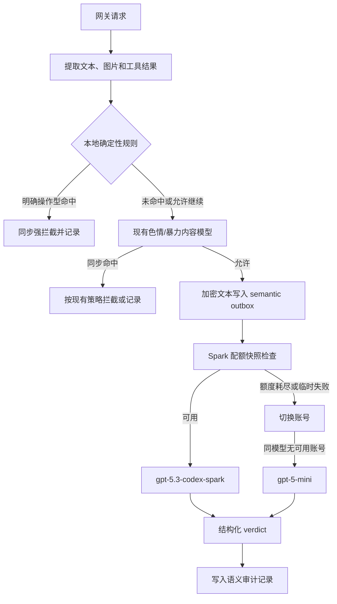

# 内容审计：规则拦截与内置模型复核

## 目标

内容审计拆成两条职责不同的链路：

1. 本地规则负责低延迟、确定性的强拦截，覆盖破限提示、越权、凭证窃取、恶意代码和明确的入侵操作。
2. 现有内容安全模型继续负责色情、暴力、自残等分类；它的结果不由语义模型替代。
3. 内置 OpenAI/Codex 账号池负责补充识别破限、逆向、凭证窃取和渗透意图。语义复核必须同时评估意图、操作性、目标、授权和可执行性；可靠 outbox 负责后置复核、重试和审计落库。

后置复核发生在请求内容已经被允许之后，不能撤回已经转发给上游的请求。`pre_block` 模式下，命中本地高风险候选（cyber/jailbreak、block 动作或 high/critical 严重度）时可以进入语义模型的同步候选复核；配置 `trigger=all` 时，即使没有关键词也会对纳入范围的文本进行同步复核；`observe` 模式只做后置复核，不影响当前请求。

Prompt Injection 使用独立的同步 reviewer。启用 `prompt_injection_reviewer_enabled` 后，它不再复用通用安全分类 schema；启用 `prompt_injection_fail_closed` 时必须同时使用 `mode=pre_block`。高风险候选的 `review`、reviewer 不可用/非法响应以及 evidence 不完整均返回 503，且不计作用户违规。

## 处理流程



## 内置模型路由

默认配置如下，模型名会在服务端归一化为这两个内置模型，未知模型不会被直接发送到账号池：

```json
{
  "semantic_review": {
    "enabled": false,
    "trigger": "local_review",
    "primary_model": "gpt-5.3-codex-spark",
    "fallback_models": ["gpt-5-mini"],
    "timeout_ms": 20000,
    "max_input_runes": 4000,
    "prompt_injection_reviewer_enabled": false,
    "prompt_injection_max_input_runes": 12000,
    "prompt_injection_fail_closed": false
  }
}
```

Spark 账号使用仓库已有的 OpenAI 调度器。Spark 额度窗口刷新复用 `OpenAIQuotaService.QueryUsage`，读取 `/backend-api/wham/usage` 中 `additional_rate_limits.metered_feature=codex_bengalfox` 的窗口，并写回账号 `extra` 的 `codex_5h_*` / `codex_7d_*` 字段。快照缺失或超过现有 10 分钟刷新窗口时，发送审查请求前先刷新一次。

路由顺序：

- Spark 额度未耗尽：发送 Spark。
- Spark 当前账号额度耗尽：释放账号并尝试同模型的下一个账号。
- Spark 账号返回 429、5xx、临时网络错误、token/账号错误：排除当前账号，刷新其额度快照，再尝试同模型的下一个账号。
- 所有 Spark 账号都不可用：切换到 `gpt-5-mini`。
- 模型已经返回 `reject`：这是业务判定，不是可恢复错误，不再换模型重试，避免把同一违规内容重复发送给更多模型。
- 所有模型均不可用：outbox 按强事件策略重试，最终进入 dead letter；后置任务不会把已经放行的请求改写成历史上的同步拦截。

请求使用账号池已有的 OAuth/Codex 凭据和代理，不使用用户在聊天中提供的第三方 API key，也不把 API key 写入 outbox、日志或审计记录。

## 输入成本控制

语义模型不接收完整对话历史。`local_review` 抽取本地高风险候选 source，并截取关键词附近文本；候选包括 cyber/jailbreak、block 动作或 high/critical 严重度规则。`all` 在同步 `pre_block` 路径中对符合范围的文本进行语义复核，即使没有配置关键词；异步路径仅抽取最近一条 user source 和最近一条 tool/function source。system、developer 和 assistant 历史默认不发送，除非其自身触发本地规则。每段最多约 1200 字符、最多 3 段，并受 `max_input_runes` 总预算硬限制；缺少结构化 source 的旧协议才回退到截断后的聚合文本。

上述 1200 字符片段预算只适用于通用 reviewer。Prompt Injection reviewer 使用当前命中的完整 user source：12K 以内发送脱敏后的完整 source；超过 12K 时构造单个合法 JSON envelope，包含 head、命中窗口和 tail。窗口必须覆盖所有高风险 occurrence；覆盖不全、source/scan 截断或 span 无法映射时设置 `EvidenceComplete=false`，模型即使返回 `allow` 也会被收敛为 `review`。

本地 detector 同时扫描 NFKC 规范化视图与可映射的 compact 视图，识别零宽、全角、大小写和空白/标点拆分；重复 occurrence 只增加证据，不重复累计规则分数。完整规范化 source 的 keyed HMAC、policy/model route、instructions/schema/evidence revision 均参与 V4 cache key，避免相同前 2K、不同危险尾部复用旧 allow。

## Prompt Injection 专用结构化结果

```json
{
  "verdict": "allow|review|reject",
  "active_override": true,
  "presentation": "direct_instruction|quoted_analysis|benign_discussion|unknown",
  "targets": ["system", "developer", "tool", "policy", "model"],
  "confidence": 0.94,
  "reason_codes": ["hierarchy_override"]
}
```

解析器要求单个、无 Markdown 包裹、无额外字段的严格 JSON。`active_override=true`、`presentation=direct_instruction` 且置信度不低于 0.80 时确定性升级为 `reject`；只有 complete evidence 的 `allow` 才能放行。

## 执行凭据

每次实际进入上游前的 HTTP 请求或 WebSocket `response.create` 帧必须产生不含原文的 receipt：`RequestID`、`Protocol`、`PolicyRevision`、`LocalScanDone`、`SemanticCalled`、`Outcome`、`ForwardAllowed`。no-hit 只写轻量 receipt，不调用 reviewer、不写完整审核记录。forward adapter 发现 receipt 缺失、未完成或不可转发时立即停止并增加固定低基数冲突指标。

## 结构化结果

模型只允许返回以下 JSON 结构：

```json
{
  "verdict": "allow|review|reject",
  "intent": "benign|defensive|harmful|ambiguous",
  "target": "none|self_owned|authorized_lab|third_party|external_service|unknown",
  "authorization": "authorized|unauthorized|unclear|not_applicable",
  "categories": ["jailbreak", "credential_theft"],
  "severity": "low|medium|high|critical",
  "confidence": 0.0,
  "operationality": "none|conceptual|actionable",
  "executability": "none|indirect|direct",
  "reason_codes": ["actionable_bypass_request"]
}
```

- `allow`：良性、防御性、教育性、已授权实验室或非操作性内容。
- `review`：目标、授权或意图无法确定，写入待人工复核记录。
- `reject`：明确的恶意意图，且具有可操作、可直接执行的能力，或明确针对未授权目标；同步候选复核场景按配置拦截，后置场景只影响审计和后续风控。

网关还会对模型结果做确定性收敛：当结果包含 `intent=harmful`、`operationality=actionable`、`executability=direct` 且 `authorization=unauthorized` 时，即使模型原始 verdict 是 `allow` 或 `review`，也升级为 `reject`。授权的自有系统、隔离实验室和 CTF 不因关键词单独命中而自动升级；授权不明确时保留 `review`。

模型输出解析同时支持 Responses JSON 和 Codex SSE；空响应、非法 JSON 和 HTTP 临时错误按可恢复失败处理，不把模型的自由文本当成放行依据。

## 数据保护与可靠性

- 发送前复用现有内容脱敏，凭证、token、邮箱和长标识符不会原样进入审计文本。
- outbox 只保存加密文本和最小请求元数据；配置副本会清除 `api_key`/`api_keys`。
- outbox 使用幂等 `decision_id`，支持进程重启后的重试、dead letter 和人工 replay。
- 通用语义模型不可用时，组合模式继续进入普通审计 API；普通审计 API 也不可用时放行并记录 `action=error`。专用 Prompt Injection fail-closed 模式不回退到通用 reviewer，不可用时返回 `semantic_review_unavailable` 和 503。
- 审计日志默认记录分类、置信度、模型、账号和原因码；原始内容仍受现有 excerpt 开关和脱敏策略控制。

## 上线建议

1. 先保持 `semantic_review.enabled=false`，验证 outbox、账号池和 `/wham/usage` 快照刷新。
2. 使用 `trigger=local_review` 小范围开启，观察 Spark 429、额度切换和 mini 使用比例。
3. 确认误报率后再扩大到 `trigger=all`；生产上仍建议保留本地规则作为强拦截第一层。
4. 监控 semantic outbox pending/retry/dead letter、模型耗时、Spark->mini 降级次数和 `review` 人工处置率。
