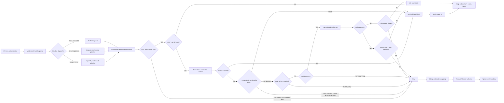
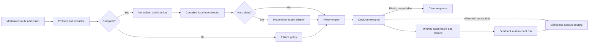
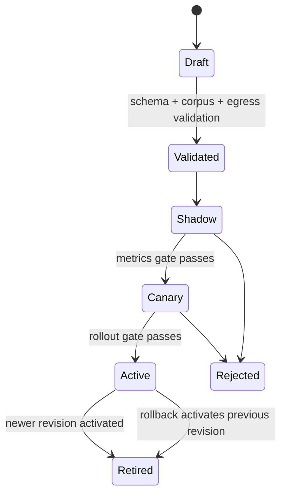

# Content Moderation Architecture Review And Redesign

**Date:** 2026-07-10

**Status:** Architecture review approved; implementation pending

**Decision:** Keep the existing gateway admission and route-coverage machinery, but replace the moderation decision core incrementally inside the current Go process. The first release contains the known security failures. The second release introduces the bounded text pipeline and versioned policy runtime. The third release connects decisions to account protection and removes legacy behavior. This is a finite three-release program, not an open-ended cleanup effort.

## 1. Scope And Success Criteria

### In scope

- Text submitted to upstream model endpoints, including multi-turn messages, system/developer content supplied by clients, tool/function definitions, tool arguments and results, Responses input, Anthropic Messages, Gemini text parts, embeddings text, and token-count request text.
- For complete, supported enforce-mode text, a two-layer detector flow:
  - high-confidence `hard_deny` rules may block immediately;
  - `contextual` rules produce evidence and continue to the moderation model;
  - any such request not blocked by a hard rule calls the moderation model.
- A `hard_deny` decision is terminal and cannot be downgraded by educational wording or a provider allow. Incomplete/unsupported input and explicit emergency `rule_only` policies follow their separately defined branches rather than pretending a model call occurred.
- Provider/model/group policy selection and explicit failure behavior.
- Minimal block evidence for manual review.
- Upstream account, API key, and channel protection signals.
- Versioned policy publication, shadow/canary rollout, rollback, metrics, and auditability.

### Out of scope

- Full raw-request evidence retention or a general-purpose forensic archive.
- Output rewriting or prompt sanitization. Rewriting changes user intent and creates a second prompt-injection surface; the first target only allows, blocks, shadows, throttles, or constrains routing.
- A remote moderation microservice. The current gateway already has a well-tested admission boundary; adding a network hop before correcting semantics would add failure modes without fixing them.
- New OCR, image classification, audio, or video moderation. Existing multimodal inputs must be reported as unsupported/incomplete rather than silently described as fully covered. A later product decision may add those capabilities, but it is not part of this program.

### Completion and stopping condition

The program is complete after Releases 1-3 meet their listed acceptance gates. Remaining image/OCR capabilities and long-term policy analytics are separate product initiatives, not unfinished work in this plan.

## 2. Review Method And Evidence

The review followed actual request paths from route registration through handler pipelines, moderation decisions, account selection, upstream forwarding, persistence, outbox processing, and the admin UI. It also read migrations, safety semantics, route coverage, tests, recent moderation commits, and focused test results at repository HEAD `ab85483f9` on 2026-07-10.

Focused non-race tests passed:

```bash
cd backend
go test ./internal/service ./internal/handler ./internal/pkg/moderationcoverage ./internal/server/routes ./internal/repository \
  -run 'ContentModeration|Moderation|ModeratedRoute|PipelineExecutionObserver' -count=1
```

That result does not mean the behavior is safe. Several tests explicitly preserve unsafe allow behavior. A focused race run also found a concurrent map read/write in the moderation test setting repository. This is a test-fixture race, not proof that the production database repository races, but it makes the current moderation suite unreliable under `-race`.

The failing race command was:

```bash
cd backend
go test -race ./internal/service ./internal/pkg/moderationcoverage \
  -run 'ContentModeration|PipelineExecutionObserver' -count=1
```

It terminated with `fatal error: concurrent map read and map write` between `contentModerationTestSettingRepo.Set` and a worker-side settings read. These are reported command observations from the review session; production concurrency remains unproven until the fixture and runtime lifecycle are repaired.

## 3. Current Architecture

### Actual request flow



The intended placement is correct: moderation runs before billing-sensitive forwarding, account selection, and provider adapters. The problem is that dispatcher gaps and decision semantics allow requests to skip or neutralize that boundary.

The separate OpenAI `cyber_policy` path observes some upstream responses after forwarding. It can support feedback and account-risk signals, but it cannot repair a missing pre-forward admission check and must not be counted as equivalent coverage.

### Current responsibilities

`backend/internal/service/content_moderation.go` is 6,450 lines and combines:

- configuration persistence and validation;
- request decisions;
- local rules and context heuristics;
- remote moderation HTTP calls and API-key health;
- async workers and cleanup;
- logging and redaction;
- user bans and email notifications;
- hash blocking;
- runtime status and route coverage reporting;
- raw request snapshot encryption and retrieval;
- cyber-policy post-upstream events.

`backend/internal/service/content_moderation_input.go` separately parses protocols, but it also contains trust decisions for supposed Codex/Claude scaffolding. Persistence is split across raw SQL repositories and the global `settings` table. The admin UI exposes most configuration through `frontend/src/views/admin/RiskControlView.vue`.

## 4. What Is Worth Keeping

1. **Admission before forwarding.** Normal covered HTTP requests are moderated before model mapping, account selection, and upstream I/O.
2. **Route inventory and consistency tests.** The route manifest currently lists 35 upstream entrypoints and the registrar, manifest, Gin routes, and runtime admission have multiple consistency checks.
3. **Broad protocol extraction intent.** The extractor understands OpenAI Chat/Responses/Messages/Embeddings/Images, Anthropic Messages, Gemini, tool calls/results, and multiple message roles.
4. **Responses WebSocket guard.** Initial and subsequent frames have dedicated moderation hooks.
5. **Useful foundations.** Decisions, redacted excerpts, review metadata, an outbox, failure-decision objects, and runtime status already exist. Their boundaries and semantics need correction rather than wholesale removal.
6. **Forward-only migrations.** Existing database practice supports the staged data migration required by this design.

## 5. Findings And Risk Ranking

### Critical

| ID | Location | Actual behavior and production impact | Resolution |
|---|---|---|---|
| C1 | `backend/internal/server/routes/gateway_pipeline_dispatcher.go:75-91,104-135` | Grok is treated as OpenAI-compatible elsewhere, but OpenAI pipeline admission rejects non-OpenAI groups while the generic pipeline skips OpenAI and Grok. Grok Chat, Responses, and Messages can reach xAI without pre-forward moderation. | Make pipeline selection protocol/capability based, not platform-exclusion based. Add real dispatcher-to-handler tests for Grok aliases and streaming variants. Release 1 blocker. |
| C2 | `backend/internal/handler/openai_gateway_count_tokens.go:49-145` | OpenAI-group `/v1/messages/count_tokens` reads, bills, selects an account, and forwards without a moderation call under the real dispatcher. | Route through the same text admission function before billing/account selection. Release 1 blocker. |
| C3 | `content_moderation.go:1200-1218,1390-1398,3126-3131` | A database error reading the global switch is interpreted as disabled. `api_only` or `hybrid` with no external API key returns allow. Both bypass the documented fail strategy. | Return typed configuration errors and evaluate the failure matrix. Public/untrusted traffic gets 503; only explicitly trusted groups may fail open on system failures. Release 1 blocker. |
| C4 | `content_moderation_input.go:79-80,1041-1072,1112-1171` | Client-controlled `<system-reminder>` blocks and broad Codex/Claude marker combinations can delete text or empty an entire Responses request. Attackers can copy the markers. | Treat every request-body field as untrusted. Internal scaffold trust must come from server-side provenance, never text matching. Release 1 blocker. |
| C5 | `content_moderation_outbox.go:79-107` and dead-letter admin APIs | Each outbox event embeds a full `ContentModerationConfig`, including plaintext moderation API keys, and a cloned log. JSONB and dead-letter responses duplicate secrets. | Outbox payloads carry only `decision_id`, `log_id`, event kind, and immutable non-sensitive parameters. Encrypt credentials outside policy JSON. Release 1 blocker. |
| C6 | `content_moderation.go:6319-6419`, migration `159_content_moderation_raw_request_snapshots.sql` | Cyber-policy paths retain up to 64 MiB of complete request bodies. Any administrator can decrypt them; encryption reuses the TOTP key and has no key ID or read audit. | Stop all writes and remove the raw-view API/UI. Retain only a redacted matched excerpt. Existing rows expire under an explicit operational cleanup after rollback support expires. |

### High

| ID | Location | Actual behavior and production impact | Resolution |
|---|---|---|---|
| H1 | `content_moderation.go:1366-1375,4956-5033` | The first local match is terminal. Words such as `policy`, `case study`, and `如何防范` downgrade a real violation and prevent semantic moderation. `observe` and `warn` can also terminate the chain. | Rules emit evidence. Only `hard_deny` is terminal. Contextual evidence always continues to the model and deny precedence is applied centrally. |
| H2 | `content_moderation.go:1452-1457,4563-4592` | Provider `flagged=true` is ignored. Only 13 fixed category scores are compared; a new category or empty scores can be allowed. | A provider adapter validates response shape. `flagged=true` is blocking unless an explicit versioned policy override exists; unknown categories are preserved and default to review/block. |
| H3 | `content_moderation.go:121,3574-3586` and extractor limits | Text is silently reduced to 12k runes, while nested tool values stop at depth/string/rune limits. Only some base64 truncation causes fail-close. An unsafe suffix can evade scanning. | Extraction returns `complete`, `truncated`, or `unsupported` with reasons and byte/rune accounting. Enforce mode never silently allows incomplete text. Chunk and scan within a total budget. |
| H4 | `content_moderation.go:149-150,482-497` | Only the first image is externally moderated, while status can imply broader coverage. | This program declares image semantics unsupported. Text in multimodal requests is still scanned; configured policy decides whether unsupported images block, use a trusted-group exception, or route to a separately approved path. |
| H5 | `content_moderation_hash_cache.go:11-70` | A single permanent Redis set has no policy/provider/model/group scope or TTL. Observe-mode and false-positive decisions can poison future traffic globally. Reviews do not reverse all effects. | Replace with a short-lived scoped decision cache keyed by HMAC(policy revision, provider policy, normalized input). No permanent global block set. |
| H6 | `content_moderation.go:898-925,1910-1919` | Every service construction starts 32 workers and a cleanup goroutine with no `Stop`. Idle workers read configuration every second; tests construct many services and leak goroutines. | One lifecycle-managed runtime starts from Wire, uses configured worker counts, an immutable policy snapshot, context cancellation, and `Close`. |
| H7 | `content_moderation.go:956-1099,3105-3123` | Every decision reads settings from the database. Updates are unlocked read-modify-write operations with no revision, CAS, atomic activation, gray rollout, or rollback. | Add immutable policy revisions and an atomic in-memory active snapshot. Publication is transactional and CAS-protected. |
| H8 | `content_moderation.go:3134-3153` | External and local classifier URLs receive only URI syntax checks. An admin credential can target private networks or send prompts/API keys over HTTP. | Require HTTPS by default, reject loopback/link-local/private destinations after DNS resolution, support an explicit host allowlist, and use a restricted transport. |
| H9 | moderation decisions and account scheduler | Decisions do not carry the selected upstream account/channel because moderation happens before selection, and non-block results are discarded. Risk cannot constrain routing or prevent account rotation from spreading abuse. | Return route constraints and record user/API-key risk before selection. Add an account risk budget fed by upstream rejection/warning signals. |
| H10 | request parsing and external-error logging | Malformed JSON head/tail and some upstream bodies can enter logs or database error text without one common redaction boundary. | All structured logs and persisted errors use one redactor; never log raw request slices. Add seed-secret tests. |

### Medium

| ID | Problem | Resolution |
|---|---|---|
| M1 | `public_group_ids` is normalized and serialized but does not participate in decisions. There is no tenant/organization policy dimension; group/model filters are only global-policy predicates. | Deprecate `public_group_ids` in Release 2 and remove it in Release 3. Bind versioned policies by provider/model/group; do not claim tenant isolation where the product has no tenant domain. |
| M2 | Policy/config, unban, hash clearing, raw reads, review, and outbox operations lack complete admin-audit coverage. | Add attempt/success/failure audit events and separate view/review/publish capabilities. |
| M3 | `UnbanUser` can activate a user not demonstrably banned by moderation. | Record a moderation ban action and only reverse that action, with an idempotent review workflow. |
| M4 | Runtime metrics are process-local atomics and a global observer mutex; failure reasons are incomplete. | Export bounded-cardinality decision, latency, provider, completeness, and rollout metrics into the existing ops pipeline. |
| M5 | The moderation test fake races with background workers; current tests cannot reliably run under `-race`. | Add synchronization and explicit runtime teardown before relying on race results. |
| M6 | The 256 MiB gateway body ceiling, multiple request copies, 10k sequential rules, and 100k queue create CPU/memory denial-of-service risk. | Add moderation-specific extraction budgets, compile rules once, bound queues by bytes and items, and enforce performance gates. |

### Low

- Duplicated legacy `keyword_blocking_mode` and `engine_mode` make configuration semantics harder to reason about.
- Magic constants and protocol-specific special cases are spread through a single large file.
- `antigravity.DefaultSafetySettings` is unreferenced; it must not be described as an active upstream protection. It can be removed in ordinary dead-code cleanup after a repository-wide reference check, but it is not part of moderation correctness.

### Immediate priority order

1. Close Grok and token-count admission gaps.
2. Make switch/config/credential failures obey fail-closed semantics.
3. Remove client-controlled scaffold trust, silent truncation, and contextual auto-downgrades.
4. Stop raw-request writes and remove credentials/config objects from outbox payloads.
5. Correct provider `flagged`/unknown-category handling and establish a reliable race/privacy test gate.

No policy-versioning or account-risk rollout should begin until these five containment items pass Release 1 gates.

## 6. Chosen Architecture

### Why this option

Three options were considered:

1. **Patch only:** fastest, but retains terminal first-match behavior, per-request database reads, global hashes, unversioned configuration, and no account risk integration.
2. **Keep ingress, replace the in-process core:** preserves proven route coverage and avoids a new network dependency while allowing deterministic contracts and staged rollout. **Chosen.**
3. **Remote moderation service:** provides independent scaling, but introduces an additional synchronous availability boundary and more sensitive-data transport. It is unjustified until traffic or organizational ownership requires it.

### Target flow



### Components

1. **Gateway Admission**
   - Owns route coverage and invokes moderation once per HTTP request and once per accepted WebSocket client turn/frame carrying upstream-bound text.
   - Does not choose policy or inspect provider results.
   - Runtime admission mismatch is a release-blocking condition.

2. **Protocol Text Extractor**
   - Converts protocol JSON to ordered `TextSegment` objects with role/source/index metadata.
   - Treats body content as untrusted regardless of marker text.
   - Enforces byte, segment, nesting, rune, and chunk budgets and reports completeness and unsupported modalities explicitly.

3. **Normalizer And Chunker**
   - Applies Unicode NFKC, case folding where appropriate, zero-width removal, whitespace normalization, and boundary-preserving compact forms.
   - Produces a canonical HMAC input and bounded chunks with overlap; it never discards an unscanned suffix without returning incomplete.

4. **Compiled Rule Detector**
   - Compiles immutable policy rules once per policy revision.
   - Emits all relevant evidence rather than returning the first match.
   - `hard_deny` is reserved for high-confidence, low-false-positive patterns. `contextual` requires model adjudication.

5. **Moderation Model Adapter**
   - Owns provider request/response validation, category mapping, time budgets, circuit state, API-key selection, restricted egress, and error taxonomy.
   - Preserves provider `flagged`, known scores, unknown categories, model name, and adapter version.

6. **Policy Engine**
   - Combines extraction state, rule evidence, model evidence, subject trust, provider/model policy, and risk state.
   - Uses deny precedence and explicit failure semantics.
   - Is pure and table-testable; it does not perform network or database I/O.

7. **Decision Executor**
   - Returns client errors, attaches route constraints, updates short-lived risk counters, emits minimal persistence events, and records metrics.
   - Does not rewrite prompts.

8. **Policy Runtime And Store**
   - Persists immutable revisions without credentials in policy JSON.
   - Atomically exposes one compiled snapshot per process.
   - Supports draft validation, shadow, canary, activation, and one-action rollback.

9. **Account Risk Manager**
   - Maintains bounded-window scores for user, client API key, group/channel, and upstream account.
   - Decisions may throttle, deny a risky user, or exclude fragile upstream accounts without routing risky traffic through every account.

10. **Minimal Audit Store**
    - Stores blocked decisions, policy revision, detector evidence, source, redacted matched excerpt, HMAC, timings, and account action.
    - Does not store the complete body or credentials.
    - Inserts the minimal decision/audit row synchronously and idempotently; the same transaction adds identifier-only side-effect outbox events. There is no asynchronous `log_write` event that needs a full log payload.

## 7. Core Domain Contracts

```go
type ModerationRequest struct {
    RequestID string
    UserID    int64
    APIKeyID  int64
    GroupID   *int64
    IngressPlatform string
    RequestedModel  string
    Protocol  string
    Body      []byte
}

type TextSegment struct {
    Source  string
    Role    string
    Index   int
    Text    string
}

type ExtractedText struct {
    Segments              []TextSegment
    Complete              bool
    FailureReason         []string
    UnsupportedModalities []string
    InputBytes            int
    ScannedRunes          int
}

type ModerationEvidence struct {
    Detector   string // rule, model, completeness, cache
    RuleID     string
    Category   string
    Severity   string
    Confidence float64
    Source     string
    Terminal   bool
}

type ModerationDecision struct {
    DecisionID     string
    PolicyRevision int64
    PolicyTarget   string // ingress platform + requested model + group binding
    Action         string // allow, block, shadow, throttle, route_constraint, error
    RiskLevel      string // none, low, medium, high, critical
    Evidence       []ModerationEvidence
    RouteConstraint RouteConstraint
    CacheTTL       time.Duration
}
```

Request bodies do not cross the decision boundary after extraction. Persistence receives a separately built `AuditRecord`, not `ModerationRequest` or the complete policy snapshot.

Policy selection uses the ingress platform, requested model, and group because the upstream account has not yet been selected. After selection/model mapping, the scheduler performs a compatibility check against `RouteConstraint` and records the effective provider, mapped model, channel, and account on the decision log. A candidate that violates the selected policy is rejected before forwarding; the request is not silently rebound to a weaker policy.

## 8. Decision Semantics

### Rule classes

| Class | Behavior | Examples |
|---|---|---|
| `hard_deny` | Immediate block; model call is not required for the user response. A shadow model call may run asynchronously only with a redacted/minimized input and an explicit evaluation policy. | Credential theft workflow with strong intent, explicit exploit deployment against a target, sexual-minor request with unambiguous action. |
| `contextual` | Add evidence and call the moderation model before the final decision. | Generic security terms, quoted policy text, education/news/legal/medical discussion, ambiguous verbs. |
| `observe` | Add telemetry only and never short-circuit another detector. | Candidate rules being evaluated in shadow. |

An educational marker is evidence, not an automatic downgrade. If mixed evidence satisfies a versioned `hard_deny` rule, the hard deny wins and is never model-downgraded. If the mixed evidence remains contextual, the moderation model adjudicates it.

### Risk levels and actions

| Risk | Default action | Account effect |
|---|---|---|
| `none` | allow | none |
| `low` | allow + metric | no account penalty |
| `medium` | allow or shadow according to active policy | increment short user/API-key observation window |
| `high` | block | increment user/API-key risk; do not expose fragile upstream accounts |
| `critical` | block + throttle/cooldown | isolate user/API key; alert; protect all upstream accounts |

No automatic permanent user disablement is based on a single request. Repeated confirmed high/critical decisions within a versioned window may create a reversible moderation ban action.

### Provider result precedence

1. Invalid/empty provider response is a provider failure.
2. `flagged=true` is evidence at least `high` unless an explicit adapter mapping says otherwise.
3. Known category thresholds may flag even if provider `flagged=false`.
4. Unknown categories are recorded. Unless `flagged=true` or the active adapter version explicitly maps them, they produce a typed provider-schema failure rather than ordinary allow.
5. A local `hard_deny` cannot be downgraded by a provider allow result.

Adapter result matrix:

| Provider shape | Adapter outcome |
|---|---|
| `flagged=true`, with or without scores | high-risk model evidence; enforce policy blocks |
| `flagged=false`, known category crosses a configured threshold | high-risk model evidence; enforce policy blocks |
| `flagged=false`, unknown categories/scores only | `schema_unknown` provider failure unless the active adapter version explicitly maps every returned category; apply fail strategy, never ordinary allow |
| `flagged=false`, scores missing/empty | `invalid_response` provider failure |
| response schema/model version is unsupported | `schema_mismatch` provider failure |
| mapped known categories below thresholds and no unknown data | allow evidence; contextual local evidence remains recorded |

## 9. Failure Matrix

| Failure | Public/untrusted enforce mode | Explicit trusted group | Shadow mode |
|---|---|---|---|
| Active policy unavailable/invalid | 503 fail-closed | 503 unless last-known-good snapshot exists; then use it | allow, emit critical metric |
| Required model credential missing/all frozen | 503 fail-closed | configurable fail-open with audit event | allow, emit critical metric |
| Moderation provider timeout/429/5xx/bad JSON | 503 fail-closed | configurable fail-open with bounded cooldown | allow, record provider failure |
| Extraction incomplete or unsupported text | 413/422 for limit/shape; otherwise 503 | explicit trusted policy only | allow, record completeness failure |
| Unsupported image/audio/video without an approved dedicated guard | 422 by default after scanning available text; never claim complete coverage | explicit `text_only_allow` trusted policy may proceed with a route constraint | allow, record unsupported modality |
| Redis decision-cache failure | Continue without cache | Continue without cache | Continue without cache |
| Audit/outbox failure after a deterministic block | Still block; synchronous minimal log best effort and critical alert | Same | Same |
| Metrics failure | Do not change decision; health becomes degraded | Same | Same |

`risk_control_enabled=false`, `fail_strategy=open`, or switching globally to observe is not a rollback strategy. Rollback means restoring the previous verified image and active policy revision.

In Release 1, switch/config load failures return 503 for every group because no trustworthy policy exists from which to establish a trusted exception. Trusted fail-open begins only after a policy has loaded successfully; last-known-good behavior becomes available with the Release 2 snapshot runtime.

Existing image endpoints with a dedicated media guard retain that guard. A request containing more images than the active guard can inspect is incomplete, not partially successful. Release 1 adds this status to the failure matrix; Release 2 carries `UnsupportedModalities` through the new domain contract. A release gate verifies that runtime health never reports full multimodal coverage while any modality is unsupported.

## 10. Policy And Credential Governance

### Policy lifecycle



- Policy revisions are immutable after validation.
- Activation uses expected-active-revision CAS in one database transaction.
- Policy state holds one active revision plus optional shadow/canary revisions, a stable cohort salt, canary percentage, rollout timestamps, authority (`legacy` or `policy`), and a lock version. The atomic runtime snapshot contains all selected compiled policies.
- Each decision records the exact revision, rule-set hash, extractor version, and model-adapter version.
- The process retains the last-known-good compiled snapshot and polls only revision metadata, not full configuration per request.
- Migration uses an advisory-locked `import -> verify -> freeze -> switch-authority -> unfreeze` workflow. Import never deletes legacy settings. After authority switches, only policy-aware images are valid rollback targets unless an explicit pre-scrub export restores the containment-baseline format.
- Legacy `risk_control_enabled`, `keyword_blocking_mode`, and settings JSON are read during migration, but only the versioned policy is authoritative after Release 2 activation. Plaintext legacy credential fields are scrubbed only after the rollback window; after scrub, pre-policy binaries are permanently forbidden.

### Credentials

- Policy JSON contains credential references, never bearer tokens.
- Moderation credentials use a dedicated stable encryption key and key ID, not the TOTP key.
- Admin APIs return masks and health only.
- Provider test APIs use configured allowlisted endpoints; callers cannot submit arbitrary destination URLs.
- Outbox, logs, metrics, and admin audit events never contain ciphertext or plaintext credentials.

## 11. Minimal Evidence And Privacy

For blocked requests, persist:

- `decision_id`, request ID, user/API-key/group identifiers;
- provider/model/protocol/endpoint;
- policy revision and detector versions;
- action, risk level, category, rule ID, confidence, matched source;
- an input HMAC using a dedicated rotation-aware key;
- one redacted evidence excerpt, maximum 512 runes: an exact matched window for a local rule, or the highest-risk audited chunk only when the provider result maps deterministically to that input chunk;
- completeness state, latency, provider outcome class, and reversible account action ID.

Do not persist:

- the complete request body;
- unrelated conversation turns;
- full tool results;
- moderation credentials or the policy object;
- arbitrary external provider response bodies.

If a model provider returns only an aggregate category with no input-index mapping, persist structured category/score evidence and no excerpt; do not label an arbitrary request prefix as the cause. Default retention is 30 days for blocked excerpts and 3 days for non-content operational errors. Maximum configurable excerpt retention is 90 days. Shadow and allow decisions retain aggregate metrics and HMAC sampling only, with no text.

Existing raw snapshots receive no new writes in Release 1. That release also makes the read endpoint return `410 Gone` and removes the raw-view control from the UI; Release 3 removes the compatibility code. Release 1 adds `expires_at` to legacy rows and a bounded cleanup job. After the patched-image rollback window, an operator-approved purge gate removes expired legacy rows. Dropping the empty table is optional and does not hold up program completion.

## 12. Account And Channel Protection

The moderation decision precedes account selection, so it cannot name an account yet. It instead returns constraints:

```go
type RouteConstraint struct {
    DenyProviders       []string
    RequireRiskTier     string
    ExcludeFragile      bool
    MaxAccountRiskScore int
}
```

The scheduler filters candidates with these constraints. Upstream policy rejections, warnings, 4xx safety responses, and manual confirmations update account/channel risk independently. The risk manager applies:

- user and client API-key cooldowns for repeated high-risk attempts;
- group/channel rate reduction when abuse concentrates in one ingress pool;
- subject/API-key risk for a request-specific upstream safety rejection; malicious client content alone never marks the shared account unhealthy;
- upstream account protection budgets only from account-specific provider warnings/status, or corroborated safety failures across multiple independent subjects in a bounded window;
- account quarantine only from those account-health signals, never from one user's content or one ambiguous local keyword;
- no retrying a policy-rejected request across additional accounts.

## 13. Observability And Feedback

Required bounded-cardinality metrics:

- decisions by action, risk level, provider policy, model family, and policy revision;
- extraction incomplete/unsupported reasons;
- rule and model detector latency;
- provider timeout/429/5xx/bad-response/no-credential counts;
- fail-closed and trusted fail-open counts;
- decision-cache hit/miss/error;
- outbox pending/dead-letter age and drops;
- route admission mismatches;
- user/API-key/account risk actions;
- review false-positive and confirmed-violation rates by rule revision.

Every decision log includes request/trace ID and decision ID. Alerts are immediate for public fail-open, missing required credentials, route/pipeline mismatch, secret leakage test failures, queue drops, or dead letters. A sustained moderation error ratio above 1% or p95 latency above the approved budget triggers warning/critical alerts.

False-positive review must atomically revoke the scoped decision cache entry and reverse only the moderation action associated with that decision. It must not activate a user disabled for another reason.

## 14. Finite Delivery Plan

### Release 1: Containment

- Fix Grok and token-count admission.
- Make missing/failed configuration and missing required credentials obey the failure matrix.
- Remove client-text scaffold trust and educational auto-downgrades.
- Treat truncation as incomplete and enforce policy.
- Honor provider `flagged` and unknown categories.
- Stop raw snapshot writes, return `410` from the read API, hide the raw-view UI, add expiry metadata, and establish an irreversible containment image baseline.
- Remove secrets/full config from new outbox events and redact parse/error logs.
- Insert minimal decision logs synchronously/idempotently and enqueue identifier-only side effects in the same transaction. Deploy dual readers first, switch the writer from v1 to v2 by CAS only after every old node exits, then convert/drain v1 rows.
- Repair test runtime lifecycle and race fixture.

Rollback: only an image at or above the Release 1 containment baseline may be used. Rolling back to an older image that can resume raw writes or secret-bearing outbox events is forbidden. Database changes are additive and v1/v2 outbox readers coexist until all legacy events drain.

### Release 2: Core replacement

- Introduce domain contracts, bounded segment extraction, compiled rule evidence, provider adapter, pure policy engine, and decision executor.
- Add versioned policy/credential storage and atomic compiled snapshots.
- Replace global hash set with a scoped TTL decision cache.
- Keep raw-request APIs/UI disabled from the containment baseline and migrate the remaining admin screen to policy revisions and minimal evidence.
- Apply 30-day blocked-evidence, 3-day operational-error, and 90-day maximum retention; allow/shadow decisions use HMAC/aggregate sampling with no text. Expire legacy allow/shadow excerpts under the bounded cleanup job.
- Run the old and new engine in shadow comparison before canary activation.

Rollback: activate the previous policy revision and a verified image no older than the containment baseline. Legacy settings remain available until policy-authority cutover and the documented scrub gate.

### Release 3: Account protection and legacy removal

- Feed route constraints into account selection and add bounded risk windows.
- Add admin capabilities/auditing, review reversal, alerts, performance gates, and replay evaluation.
- Stop reading legacy engine fields and remove dead runtime branches/UI fields after compatibility tests.
- Retire old global hash behavior and legacy raw-view code. Existing database data remains governed by retention/explicit cleanup.

Rollback: a containment-baseline-or-newer image plus the previous policy revision; account-risk changes are TTL-scoped and reversible.

## 15. Release Gates

Each release must pass all gates relevant to its changed surface:

1. Focused unit/integration tests and the gateway route-manifest consistency suite.
2. Race tests with no leaks or concurrent access findings.
3. Bypass corpus for tail truncation, spoofed markers, mixed educational/harmful intent, tool content, Unicode/zero-width variants, and all supported text protocols.
4. Secret-seed assertions for logs, database rows, outbox payloads, and admin responses.
5. Benchmarks for 12k-rune text with 10k rules, large multi-message extraction, and concurrent decisions; no unexplained >20% regression and no nonlinear memory growth.
6. Staging replay, then 5%, 25%, and 100% canary gates with zero public fail-open, zero route mismatch, zero secret leak, zero dead-letter/drop, and approved latency/error budgets.

Every release uses staging, 5%, 25%, and 100% gates. Pause promotion if total gateway errors increase by 0.5 percentage points over five minutes, p95 moderation latency exceeds the pre-approved absolute SLA or 120% of baseline, or CPU/RSS per request exceeds 120% of baseline. Immediate rollback conditions include any bypass-corpus miss, public fail-open, secret disclosure, panic/race, route mismatch, unusable required credentials reported healthy, dead-letter/drop, or a moderation-induced 503 increase of 1 percentage point over five minutes.

## 16. Alternatives Rejected

- **Keep `rule_only` as the normal production mode:** rejected because the stated goal is local rules followed by a moderation model. It remains an explicit emergency/development policy only and cannot claim full protection.
- **Let a model adjudicate every hard rule:** rejected because it adds latency and creates an availability dependency for deterministic, high-confidence blocks.
- **Retain full raw requests encrypted:** rejected because the user requires only the blocked fragment, and current access/key lifecycle is disproportionate to the account-protection goal.
- **Permanent exact-input blocklist:** rejected because it is hard to scope, expire, and reverse. A revisioned TTL decision cache provides the cost benefit without permanent cross-policy poisoning.
- **Big-bang microservice extraction:** rejected until the in-process contracts and operational budgets are proven.

## 17. Known Residual Risks At Completion

- Text-only moderation cannot judge unsafe image pixels, audio, or video. The policy must expose that limitation and avoid claiming complete multimodal coverage.
- A third-party moderation model receives user text and remains a privacy and availability dependency; egress allowlisting, contractual controls, and minimal inputs reduce but do not remove this risk.
- No rule/model system eliminates false positives or adversarial evasion. Versioned evaluation, review feedback, and account-level signals are required ongoing operations, not additional architecture work.
- Provider policies change independently. Adapter compatibility tests and policy revisions must be part of routine releases.

## 18. Deliverable Traceability

| Deliverable | Covered by | Acceptance evidence |
|---|---|---|
| D1 Current architecture overview | Sections 3 and 4 | Current-flow diagram and responsibility inventory |
| D2 Real request call chain | Sections 3 and 5, C1-C3 | Route/handler tests in Release 1 |
| D3 Reasonable existing design | Section 4 | Preserved-component list |
| D4 Ranked problem list | Section 5 | Critical/high/medium/low matrix with locations and remedies |
| D5 Highest priorities | Section 5, immediate priority order | Release 1 gate |
| D6 Target architecture | Sections 6-12 | Target flow, components, contracts, failure and routing rules |
| D7 Optimization vs refactor comparison | Section 6 | Three-option decision record |
| D8 Recommendation and reason | Sections 1 and 6 | Chosen in-process core replacement |
| D9 Phased implementation | Section 14 and companion plan | Three release gates and final stop checklist |
| D10 Test and verification | Sections 13 and 15; companion-plan Tasks 1, 4, 5, 7, 13, and 14 | Executable race/fuzz/corpus/privacy/migration/performance commands and gates |
| D11 Deployment, canary, rollback | Sections 10, 14, and 15 | Immutable versions, containment baseline, rollout/rollback rehearsal |
| D12 Implemented changes | Section 19 | Explicitly none during review/design |
| D13 Recommended later work | Sections 1, 14, and 17 | Explicit out-of-scope/residual items, each requiring a new plan |
| D14 Residual risks and debt | Section 17 | Text-only, third-party, evasion, and provider-policy risks |

## 19. Implementation Status

This document records the reviewed design. No production code or data has been changed as part of the architecture-review stage. The exact implementation tasks, files, commands, rollout steps, and stopping gates are defined in the companion implementation plan.
