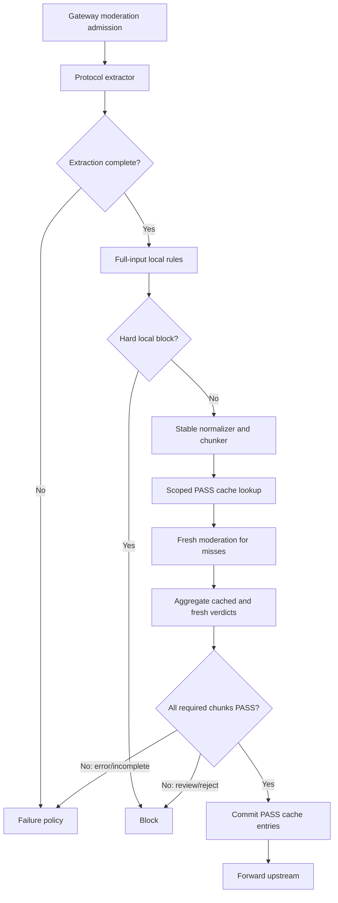

# Incremental Content Moderation Cache And Zhipu Adapter

**Date:** 2026-07-11

**Status:** Specification reviewed and approved; ready for implementation planning

**Decision:** Add provider-aware moderation adapters and a short-lived, scoped PASS cache over stable overlapping text chunks. Every request still runs local deterministic checks over the complete extracted input. External moderation reuses cached PASS verdicts only for byte-equivalent normalized chunks under the same provider, model, audit scope, policy scope, and chunker version. New or changed chunks are moderated before upstream forwarding. Any incomplete extraction, missing verdict, provider error, `REVIEW`, or `REJECT` follows explicit fail-closed policy in pre-block mode.

This design supplements `2026-07-10-content-moderation-architecture-design.md`. Where the documents overlap, the architecture review's privacy, completeness, policy-versioning, and failure requirements remain authoritative.

## 1. Problem And Evidence

The external Zhipu moderation endpoint accepts at most 2,000 text characters per request. Real Codex Responses requests can be much larger and resend nearly all prior context on every turn.

One production `cyber_policy` sample reviewed for this design had:

- 166,049 raw JSON bytes;
- 159,703 Unicode code points in the serialized request;
- 64,745 normalized code points in message bodies;
- 35,481 normalized code points in user-role message bodies;
- 6,433 normalized code points in the last user message.

Moderating all message text with 1,800-character chunks and 200-character overlap requires about 41 external calls on the first pass. Moderating only the last user message requires four calls but misses changed developer/system content, tool arguments, tool results, and modified history. Repeating all 41 calls on every append-only turn is unnecessary.

The desired behavior is therefore:

1. scan all extracted text locally on every request;
2. externally moderate all text on the first complete request;
3. reuse exact PASS verdicts for unchanged stable chunks;
4. externally moderate only chunks affected by appended or modified content;
5. never treat truncation, cache failure, or a partial batch as PASS.

## 2. Scope

### In scope

- OpenAI-compatible and Zhipu moderation provider adapters.
- Stable Unicode text chunking with overlap.
- Incremental external moderation through a scoped Redis PASS cache.
- Complete-request aggregation across cached and fresh chunk verdicts.
- Pre-block and observe-mode failure semantics.
- Admin configuration and key-test support for the Zhipu provider.
- Metrics and logs for chunk counts, cache behavior, provider outcomes, and completeness.
- Focused backend and frontend tests.

### Out of scope

- Training a classifier from historical prompts.
- Automatically converting OpenAI `cyber_policy` records into blocking rules.
- Persisting additional full raw requests or prompt corpora.
- Audio or video moderation.
- A general remote moderation microservice.
- Semantic summarization of long prompts. Summaries are not a safety-preserving substitute for complete scanning.
- Fixing unrelated moderation architecture findings outside code paths required by this feature.

Existing OpenAI `cyber_policy` records may be used as an offline, access-controlled evaluation corpus. This implementation must not add new raw-body persistence or include user identity data in external moderation requests.

## 3. Options Considered

### Option A: Moderate all context on every request

This is simple and complete but repeatedly sends unchanged Codex history. The observed sample would require about 41 calls per turn. It increases latency, rate-limit pressure, cost, and sensitive-data transmission.

### Option B: Moderate only the latest user message

This reduces the observed sample to four calls, but it is unsafe. Client-supplied developer/system messages, tool results, function arguments, unknown roles, and changed history can all affect the upstream model.

### Option C: Stable chunks plus scoped PASS cache

This externally moderates the complete context on first use, then reuses exact PASS verdicts for unchanged chunks. Append-only turns usually invalidate only the previous tail chunk and create new tail chunks. Modified or reordered history changes downstream chunks and forces re-moderation. This option is chosen.

## 4. Safety Invariants

The implementation must preserve these invariants:

1. Local deterministic rules scan the complete extracted input on every request, independent of the external cache.
2. Only `PASS` external verdicts are reusable. Errors, timeouts, incomplete results, and unknown values are never cached.
3. A cache hit is valid only under the exact provider, moderation model, audit scope, policy scope, chunker version, and normalized chunk text.
4. Every required chunk must have a valid PASS verdict before a pre-block request can proceed.
5. Any `REVIEW` or `REJECT` is an explicit moderation hit. Trusted-group failure exceptions do not bypass explicit hits.
6. Extraction truncation or unsupported required text is not silently allowed in pre-block mode.
7. Redis failure disables reuse but does not disable moderation. The service calls the provider for all chunks.
8. Raw prompt text never appears in Redis keys, Redis values, metrics, or structured logs.
9. Cache entries are bounded by TTL and policy scope. There is no permanent global PASS allowlist.
10. The feature does not trust client-controlled Codex/Claude marker text as provenance.

## 5. Target Flow



Local rule evaluation remains before external cache lookup. A cached external PASS must never suppress a newly published local rule.

## 6. Components And Interfaces

### 6.1 Extracted input

The protocol extractor returns ordered sources and completeness metadata:

```go
type ModerationTextSource struct {
    Source string
    Role   string
    Text   string
}

type ModerationExtraction struct {
    Sources         []ModerationTextSource
    Complete        bool
    TruncateReasons []string
    TotalRunes      int
}
```

The extractor must not reconstruct a supposedly complete string after applying per-source limits. If any source or nested tool value exceeds a configured extraction budget, `Complete` is false and the reason is retained.

The implementation may adapt the existing `ContentModerationInput` instead of adding these exact public types, but the completeness contract and ordered source boundary must be explicit and testable.

### 6.2 Canonicalizer, source framing, and stable chunk planner

These are three independently testable units:

```go
type ModerationCanonicalizer interface {
    CanonicalizeExtraction(ModerationExtraction) (CanonicalStream, error)
}

type ModerationChunkPlanner interface {
    Plan(CanonicalStream) ([]ModerationChunk, error)
}

type ModerationChunkCache interface {
    LookupPASS(ctx context.Context, keys []ChunkCacheKey) (ChunkCacheLookup, error)
    StorePASS(ctx context.Context, keys []ChunkCacheKey, ttl time.Duration) error
}
```

The canonicalizer and chunk planner operate on ordered extracted sources, not serialized request JSON. The exact canonicalization sequence is:

1. reject invalid UTF-8 and mark extraction incomplete;
2. apply Unicode NFKC;
3. remove `U+200B`, `U+200C`, `U+200D`, `U+2060`, and `U+FEFF`;
4. map every Unicode whitespace code point recognized by Go `unicode.IsSpace` to ASCII `U+0020`;
5. collapse consecutive ASCII spaces to one;
6. trim leading and trailing ASCII spaces per source;
7. lowercase and trim the server-derived role name; keep the server-derived source name byte-exact.

Canonicalization occurs once. The exact same canonical text sent to the provider participates in cache identity; there is no second provider-only normalization.

Sources are joined for provider text with one ASCII line feed (`U+000A`). Source text cannot create a cache collision because the cache key also includes a binary context frame. For every chunk, the context frame is encoded as:

```text
chunk-context-v1 ||
uvarint(number-of-overlapping-source-spans) ||
for each overlapping source span in order:
  uvarint(role-byte-length) || role-utf8 ||
  uvarint(source-byte-length) || source-utf8 ||
  uvarint(source-local-start-rune) ||
  uvarint(source-local-end-rune)
```

The frame is length-prefixed; no sentinel escaping rule is required. Identical text in user, developer, system, assistant, tool, or function-result contexts therefore has a different cache identity. `audit_scope` is exactly one of the existing normalized values `all_context`, `user_and_tool`, or `user_only` and is also included in the cache key.

Defaults:

```text
max chunk runes: 1800
overlap runes: 200
stride: 1600
chunker version: zhipu-text-v1
max chunks per request: 64
```

Normalization for chunk identity uses Unicode NFKC, zero-width character removal, line-ending normalization, and whitespace compaction. The original normalized display text may preserve more structure for local rules, but cache identity must be deterministic.

Chunk boundaries use fixed rune offsets. Natural-language, sentence, paragraph, or whitespace boundary adjustment is explicitly forbidden because it would make cached chunks move when text is appended. For a canonical stream of `N` runes, chunk `i` is:

```text
start = i * 1600
end   = min(start + 1800, N)
text  = stream[start:end]
```

Chunks are stable for append-only input:

- every full 1,800-rune chunk never changes when text is appended;
- the previous partial tail chunk changes until it reaches 1,800 runes;
- new text produces only new tail chunks;
- deleting, inserting, or changing earlier text changes affected and downstream chunks, forcing misses.

The single line-feed source join naturally carries text across message and tool boundaries inside overlapping windows. Source/role framing is carried by the HMAC context frame rather than injected as provider instructions.

Each chunk records non-sensitive source spans for diagnostics:

```go
type ModerationChunk struct {
    Index       int
    Text        string
    RuneCount   int
    SourceStart int
    SourceEnd   int
    ContextFrame []byte
}
```

No chunk may exceed the provider's 2,000-character limit after final normalization. The 200-character margin is intentional.

### 6.3 Provider adapters

The external provider contract is provider-neutral:

```go
type ModerationLevel string

const (
    ModerationPass   ModerationLevel = "PASS"
    ModerationReview ModerationLevel = "REVIEW"
    ModerationReject ModerationLevel = "REJECT"
)

type ProviderModerationResult struct {
    Level      ModerationLevel
    RiskTypes []string
    Scores    map[string]float64
}

type ModerationProvider interface {
    ModerateText(ctx context.Context, model, apiKey, text string) (ProviderModerationResult, error)
}
```

The OpenAI adapter calls `/v1/moderations` and requires exactly one result for one input chunk. Existing configured thresholds apply to the existing known category set declared by `contentModerationCategoryOrder`. Mapping is exact:

1. empty or multiple results, missing/empty scores, or an unsupported shape is `invalid_response`;
2. `flagged=true` maps to `REJECT` regardless of scores;
3. a known category at or above its configured threshold maps to `REJECT`;
4. any returned category not mapped by the active adapter version is `schema_unknown`, not PASS or REVIEW;
5. only `flagged=false` with all returned categories known and below thresholds maps to `PASS`.

The adapter preserves all known scores and bounded category names for evidence. `schema_unknown` follows provider-failure policy.

The Zhipu adapter calls `/paas/v4/moderations` under `https://open.bigmodel.cn/api` by default and sends one text string with model `moderation`. Because one request represents exactly one chunk, the adapter requires exactly one `result_list` entry. Zero or multiple entries are `invalid_response`; the adapter does not guess whether multiple entries are duplicates. The one entry must contain exactly one known level `PASS`, `REVIEW`, or `REJECT`.

`risk_type` values are trimmed, deduplicated case-sensitively, sorted by UTF-8 byte order, limited to 32 entries, and limited to 64 Unicode runes per entry. Empty values are removed. Exceeding either bound or returning a non-string value is `schema_mismatch`. The single entry's level is the chunk level, so no cross-entry severity aggregation exists in adapter version `zhipu-v1`.

Provider URL construction is adapter-owned. The admin `base_url` remains a provider base, not a complete endpoint:

```text
openai default base: https://api.openai.com
zhipu default base:  https://open.bigmodel.cn/api
zhipu endpoint:      /paas/v4/moderations
zhipu model:         moderation
```

Both production and admin key-test calls use the same restricted egress client:

- HTTPS is mandatory;
- redirects are disabled;
- default allowlisted hosts are `api.openai.com` for OpenAI and `open.bigmodel.cn` for Zhipu;
- custom hosts must appear in the server-owned `MODERATION_ALLOWED_HOSTS` allowlist;
- DNS answers are resolved before connection and loopback, private, link-local, multicast, unspecified, and metadata-service destinations are rejected for IPv4 and IPv6;
- the restricted dialer connects only to a validated resolved address and does not fall back to the original hostname after validation;
- credentials are never forwarded across a redirect or host change.

Invalid or unsafe endpoints fail configuration validation before activation.

### 6.4 Scoped PASS cache

The cache stores only successful PASS verdicts. The key is an HMAC, not a plain content hash:

```text
HMAC-SHA256(
  cache-key-secret,
  provider || 0x00 ||
  moderation-model || 0x00 ||
  audit-scope || 0x00 ||
  policy-scope || 0x00 ||
  chunker-version || 0x00 ||
  cache-key-version || 0x00 ||
  feedback-epoch || 0x00 ||
  chunk-context-frame || 0x00 ||
  normalized-chunk-text
)
```

Every string field in this HMAC message is UTF-8 preceded by an unsigned big-endian 32-bit byte length. Integer versions use unsigned big-endian 64-bit encoding. The displayed `0x00` separators are explanatory; the implementation uses length-prefix encoding and does not rely on delimiter escaping. Golden vectors define the complete HMAC message bytes and digest.

The backend configuration owns a dedicated `MODERATION_CACHE_HMAC_KEY`, encoded as exactly 64 hexadecimal characters (32 bytes), and an integer `MODERATION_CACHE_HMAC_KEY_VERSION` greater than zero. Every replica sharing Redis must use the same key and version. The key is not stored in policy JSON or exposed through admin APIs.

When PASS caching is enabled but the key is missing or invalid, startup marks moderation-cache health unavailable and disables cache reads/writes; external moderation still runs for every required chunk. It must not silently substitute another application secret. Rotation installs the new key on every replica and increments the version. Because the version is part of the Redis key, old entries become unreachable immediately and expire naturally. Mixed key versions across live replicas are a deployment-health failure and block cache enablement during rollout.

`policy-scope` comes from a dedicated `ModerationPolicyScopeProvider`:

```go
type ModerationPolicyScopeProvider interface {
    ActiveScope() string
}
```

When the immutable policy runtime from the authoritative architecture is active, this is its immutable active revision ID. Until that runtime is deployed, the safe legacy value is:

```text
legacy-v1:<sha256-of-canonical-effective-safety-config>
```

The canonical legacy config includes provider, validated base host/path, moderation model, audit scope, thresholds, normalized local rules, engine mode, model/group filters, failure policy, adapter version, extractor version, chunker version, and `moderation_feedback_epoch`. It excludes credentials, cache TTL, worker/concurrency counts, retry counts, and other operational tuning that cannot change a PASS verdict. Canonical JSON uses lexicographically sorted UTF-8 keys, no insignificant whitespace, normalized numeric decimal forms, and normalized ordered rule/filter arrays. Loading a different effective safety config produces a different scope before cache lookup.

This legacy digest is a compatibility bridge, not a replacement for immutable policy governance. It permits safe cache invalidation without a database migration; canary promotion still records the digest, and later policy-runtime activation replaces it with the immutable revision ID. Image rollback restores the prior verified binary and effective config or immutable revision.

`moderation_feedback_epoch` is a non-negative integer stored through the existing settings repository. It is included in policy scope and HMAC identity. A confirmed high-severity upstream miss increments it atomically, making every older PASS entry unreachable across replicas without deleting Redis by pattern.

Redis key format:

```text
moderation:pass:v1:<hmac-hex>
```

The value contains only schema version and expiration metadata. Default TTL is 24 hours. TTL must be clamped to a safe server-defined range.

Batch behavior:

1. look up all chunk HMACs with one pipelined operation;
2. moderate misses with bounded concurrency;
3. aggregate all cached and fresh results;
4. write fresh PASS entries only if the complete request decision is PASS;
5. do not write partial PASS entries for a request that ends in review, reject, error, or incomplete extraction.

Redis read/write failures are metrics and logs, not moderation failures. Provider calls replace unavailable cache entries.

Redis lookup is all-or-nothing for a request. Any pipeline command error, missing pipeline reply, decode error, or connection interruption discards every cache hit returned by that lookup and calls the provider for all required chunks. This deliberately gives up partial reuse to make failure behavior deterministic. Redis write pipelines are best effort after a complete PASS; partial writes are allowed because every written entry is independently scoped and valid.

Before PASS lookup, the service checks a scoped request quarantine key derived from the HMAC of the complete canonical stream. A present quarantine key is explicit REVIEW evidence and blocks in pre-block mode. Quarantine entries contain no text and use TTLs; they are not permanent global blocklist entries.

### 6.5 Batch executor

Defaults:

```text
worker concurrency: 4
per-call timeout: 3 seconds
whole-batch timeout: 8 seconds
per-chunk retries: 1
max chunks: 64
```

The executor uses the existing API-key health and rotation behavior, with a request-level call budget so retries cannot multiply without bound. `REJECT` may cancel outstanding work immediately. `REVIEW` may also cancel in pre-block mode because it is blocking, but observe mode may finish outstanding chunks to collect complete diagnostics.

Cancellation, rate limits, authentication errors, timeouts, malformed responses, and missing chunk results are typed errors. A partial batch is never aggregated as PASS.

The executor boundary is independently testable:

```go
type ModerationBatchExecutor interface {
    Execute(ctx context.Context, request ModerationBatchRequest) (ModerationBatchResult, error)
}
```

It depends only on a provider adapter, API-key selector, clock, and concurrency limits. It does not decide allow/block policy or write cache entries.

### 6.6 Aggregator

Severity order is:

```text
REJECT > REVIEW > PASS
```

Pre-block behavior:

| Batch state | Decision |
|---|---|
| All required chunks PASS | Allow |
| Any REVIEW | Block as explicit moderation hit |
| Any REJECT | Block as explicit moderation hit |
| Any missing/error/incomplete result | Apply configured failure policy; public/default is fail-closed |

Observe mode records review/reject/error outcomes but does not block solely because of the external result. Local hard-deny rules retain their existing terminal semantics.

Aggregation is a pure function over extraction state, required chunk IDs, cache lookup state, fresh provider results, and active failure policy. It performs no network, cache, repository, or logging I/O.

Concrete failure mapping is:

| Condition | Public/untrusted pre-block | Explicit trusted pre-block | Observe/shadow |
|---|---|---|---|
| Malformed JSON or invalid UTF-8 rejected by request parsing | HTTP 400; never forward | Same | Same |
| Chunk budget over 64 / supported text-size limit | HTTP 413; action `error`; never forward | Same unless an active versioned trusted policy explicitly permits incomplete text | Forward with incomplete audit event |
| Unsupported required text shape | HTTP 422; action `error`; never forward | Same unless an active versioned trusted policy explicitly permits the shape | Forward with unsupported event |
| Other extraction incompleteness | HTTP 503 fail-closed; action `error` | Explicit trusted failure policy may fail open only after a valid policy snapshot loaded | Forward with completeness-failure event |
| Provider timeout, 429, 5xx, authentication exhaustion, bad JSON, schema mismatch/unknown, batch timeout, cancellation, or missing result | HTTP 503 fail-closed; action `error` | Explicit trusted failure policy may fail open with audit event and bounded cooldown | Forward with provider-failure event |
| Redis lookup/read failure, including partial pipeline reply | Discard all hits and call provider for every chunk | Same | Same |
| Redis PASS write failure after complete PASS | Allow; mark cache degraded | Same | Same |
| Any explicit REVIEW or REJECT | Configured moderation block status/message; action `block` | Same; trusted failure exceptions do not apply | Forward and record explicit hit |

An ordinary client disconnect cancels work and produces no allow decision because no request is forwarded. Internal cancellation after an explicit block preserves that block. Every error class has one stable machine-readable code used by service tests and metrics.

## 7. Configuration And Admin UI

Extend content-moderation configuration with:

```json
{
  "provider": "openai",
  "base_url": "https://api.openai.com",
  "model": "omni-moderation-latest",
  "pass_cache_enabled": false,
  "pass_cache_ttl_seconds": 86400
}
```

Backward compatibility:

- missing `provider` means `openai`;
- missing `pass_cache_enabled` means `false`; this boolean is the only supported operational cache enable/disable control;
- `pass_cache_ttl_seconds=0` does not disable caching: when caching is enabled it normalizes to the default TTL;
- existing base URL, model, API keys, thresholds, timeout, retry, mode, scope, group, and failure fields remain valid;
- switching provider changes default base/model only when the administrator has not supplied custom values;
- changing provider, model, scope, policy scope, or chunker version naturally invalidates reuse through cache-key scope.

The admin UI adds a provider select with `OpenAI` and `Zhipu`, an explicit PASS-cache toggle, and cache health text. Base URL and model placeholders follow the selected provider. Existing key testing uses the selected provider adapter and includes the same response validation as production calls.

Chunk size, overlap, concurrency, timeouts, maximum chunks, and chunker version remain server-owned constants in the first release. Exposing them as routine UI controls would make unsafe configurations too easy. PASS-cache TTL may be exposed only in an advanced section with server-side bounds.

All new user-visible text must be added to English and Chinese locale files.

## 8. Completeness And Oversized Requests

The current provider budget supports up to 64 chunks. With 1,800 runes and 200 overlap, this covers roughly 102,600 normalized runes.

When extraction is incomplete or more than 64 chunks are required:

- pre-block mode returns a typed moderation-unavailable/too-large decision and does not forward upstream;
- observe mode records the incomplete reason and may forward according to existing observe semantics;
- no PASS cache entries are written;
- metrics distinguish extraction truncation from chunk-budget overflow.

The service must not trim the suffix and present the request as fully audited.

## 9. Privacy And Feedback

The cache contains no raw text. Structured logs contain chunk counts, HMAC prefixes only when operationally necessary, provider/model, hit/miss counts, latency, risk level, and bounded risk-type values. They do not contain prompt text, email addresses, user IDs in provider payloads, API keys, URLs, or raw request slices.

OpenAI `cyber_policy` remains a post-upstream account-risk and evaluation signal, not proof that a particular cached chunk was unsafe. The system must not label every chunk in a blocked request as a positive example or automatically publish a rule.

This implementation may record a non-sensitive comparison event:

```text
request decision id
provider/model/policy scope
chunk count and cached/fresh counts
Zhipu aggregate level and bounded risk types
OpenAI cyber_policy=true
```

It must not expand raw-request retention. Historical raw records may be used in a separate, access-controlled offline evaluation process and must not be embedded in repository fixtures.

An event is eligible for Zhipu/OpenAI comparison only when:

- the pre-forward decision used provider `zhipu`;
- extraction was complete and every required chunk had PASS evidence;
- the request was actually forwarded to OpenAI;
- the upstream `cyber_policy` event carries the same request ID and decision ID;
- the event is observed within ten minutes of forwarding.

The denominator is all eligible complete Zhipu-PASS requests forwarded to OpenAI. The numerator is eligible requests with a correlated upstream `cyber_policy`. Missing request/decision IDs, events after ten minutes, local session-block repeats, and requests not sent to OpenAI are excluded and counted separately as correlation-quality metrics. Comparison metadata is retained for 30 days and is visible only to the existing restricted risk-control admin capability. No prompt body is added to the event.

The comparison event stores the scoped complete-request HMAC and the at-most-64 scoped chunk cache keys that participated in the PASS. These values are non-reversible HMACs and remain restricted admin metadata.

Every correlated miss immediately:

1. deletes all referenced PASS chunk keys on a best-effort basis;
2. writes a scoped request quarantine entry with a 24-hour TTL;
3. queues the request-level event for human review.

The quarantine check happens before PASS-cache lookup, so an exact repeated request is REVIEW/block evidence even if a concurrent worker had already cached a chunk. A `false_positive` review removes the quarantine entry and does not increment the feedback epoch. A `confirmed_violation` extends the request quarantine to 30 days and, for high-severity review, atomically increments `moderation_feedback_epoch`; this invalidates all prior PASS-cache scope across replicas. Failure to write quarantine or increment the required epoch is a critical risk-control error and keeps the event unresolved; pre-block rollout gates cannot pass while such an event exists.

`confirmed_violation` and `false_positive` remain request-level labels and must never be copied automatically onto every chunk or converted automatically into permanent keyword rules. Promotion to pre-block requires zero unresolved correlated misses older than 24 hours and zero confirmed high-severity misses during the canary observation window.

## 10. Observability

Add bounded-cardinality metrics:

- extracted source count and normalized rune count;
- chunk count and chunk-budget overflow;
- PASS cache hit, miss, read error, and write error;
- fresh provider call count, retry count, latency, and error class;
- aggregate PASS/REVIEW/REJECT/error decision;
- number of requests with OpenAI `cyber_policy` after a Zhipu PASS;
- eligible comparison denominator, correlated numerator, excluded/missing-correlation counts, and pending-review age;
- batch cancellation and deadline exhaustion.

Runtime status reports the configured provider, model, cache availability, cache TTL, chunker version, and effective chunk limits without exposing keys or cache HMACs.

## 11. Rollout And Compatibility

1. Introduce provider adapters behind the current OpenAI behavior. Keep `provider=openai` as the default.
2. Add stable chunking with the cache disabled; verify complete aggregation and failure behavior in shadow/observe mode.
3. Enable the scoped PASS cache in observe mode and compare cached decisions against sampled fresh calls.
4. Enable Zhipu for an explicit group/model canary.
5. Enable pre-block only after all measurable promotion gates pass.

Promotion gates are:

- at least seven consecutive days and 10,000 complete moderated requests in shadow/canary, whichever occurs later;
- 100% decision equivalence between cache hits and at least 1,000 sampled forced-fresh rechecks, excluding provider failures that are compared separately;
- zero request forwarded with incomplete extraction, missing chunk evidence, REVIEW, or REJECT in enforce-path tests and canary telemetry;
- provider/batch failure rate below 0.5% over the final 24 hours;
- P95 incremental moderation latency below 1.5 seconds and P95 cold first-pass latency below 6 seconds over the final 24 hours;
- zero unresolved correlated Zhipu-PASS/OpenAI-`cyber_policy` events older than 24 hours;
- zero human-confirmed high-severity correlated misses during the observation window;
- correlation-eligible events have at least 99.9% request-ID and decision-ID completeness.

Switching provider or disabling cache is an emergency mitigation, not rollback. Rollback follows the authoritative architecture: deploy the previous verified image and activate the previous immutable policy revision. Provider/model/cache scope in the key makes stale entries unreachable, and TTL removes them within 24 hours.

No database migration is required for the initial configuration because moderation config is stored as version-tolerant JSON. Redis keys are additive and expire automatically.

## 12. Testing

### Chunker tests

- ASCII, Chinese, emoji, combining marks, and invalid/zero-width input.
- Exact 1,800, 1,801, and 2,000-character boundaries.
- Every chunk is at most 1,800 runes.
- Adjacent chunks overlap by exactly 200 runes when both are full.
- Append-only input preserves completed chunk identities.
- Insert/delete/reorder invalidates affected downstream chunks.
- Text split across message/tool boundaries appears in overlapping chunks.
- More than 64 chunks returns incomplete instead of truncating.
- Golden canonicalization vectors cover NFKC-equivalent Unicode, every removed zero-width code point, all supported whitespace classes, invalid UTF-8, source text containing separator-like strings, role/source changes, and exact binary context framing.
- Golden append vectors prove that fixed-stride completed chunks do not move and only the partial tail changes.

### Cache tests

- Exact repeated chunks hit.
- Provider, model, scope, policy scope, or chunker-version changes miss.
- Plain prompt text never appears in Redis keys or values.
- Redis read failure causes provider calls.
- A partial Redis pipeline reply discards all hits and calls the provider for every chunk.
- Redis write failure does not change a PASS decision.
- Partial/rejected/error batches write no PASS entries.
- TTL is present and bounded.
- Missing/invalid HMAC secrets disable cache without bypass; key-version rotation immediately misses old entries; replica version mismatch degrades health.
- Explicit `pass_cache_enabled=false` performs no cache reads/writes; enabling with TTL zero applies the default TTL.
- Golden HMAC vectors cover every length-prefixed string, big-endian integer, policy scope, feedback epoch, context frame, and normalized chunk text.
- A correlated upstream miss deletes referenced PASS keys and creates request quarantine; false-positive review removes it; confirmed high-severity review increments the feedback epoch and invalidates old scope.
- Quarantine Redis read failure cannot become PASS; quarantine write/delete failures remain unresolved risk events and surface degraded health.
- Concurrent confirmed high-severity reviews increment `moderation_feedback_epoch` atomically without lost updates, and every replica observes the new scope before cache reuse.

### Provider tests

- OpenAI path, payload, flagged handling, score thresholds, empty results, and unknown shape.
- Zhipu path `/paas/v4/moderations`, model `moderation`, Bearer auth, and PASS/REVIEW/REJECT parsing.
- Zhipu empty list, unknown risk level, HTTP error, timeout, and conflicting results fail safely.
- Payload text never exceeds 1,800 runes.
- Both production and key-test transports reject HTTP, redirects, non-allowlisted hosts, private/loopback/link-local/metadata IPs, unsafe DNS answers, and host changes.
- Provider schema-evolution golden fixtures prove unknown OpenAI categories and unknown Zhipu risk levels cannot become PASS.

### Service tests

- Local rules execute despite full PASS-cache coverage.
- First 64,745-character request moderates every chunk.
- Repeated request uses cached PASS entries.
- Appending a 6,433-character user message moderates only changed/new tail chunks.
- Changed historical content invalidates downstream chunks.
- REVIEW and REJECT block in pre-block mode.
- Missing/error/incomplete results obey fail-closed semantics.
- Observe mode records without external-result blocking.
- Concurrent requests do not race cache or API-key health state.

### Frontend tests

- Provider selection applies safe defaults without overwriting saved custom values.
- Zhipu placeholders and localized descriptions render.
- API-key test sends provider/base/model correctly.
- Existing OpenAI configurations remain unchanged after load/save.

## 13. Acceptance Criteria

The feature is complete when:

1. Zhipu can be configured with base URL `https://open.bigmodel.cn/api` and model `moderation` and passes the admin key test.
2. No outbound Zhipu text payload exceeds 1,800 Unicode code points.
3. A complete first request externally moderates every required chunk or fails closed.
4. An unchanged repeated request performs zero external calls after PASS cache population.
5. Appending text performs external calls only for changed/new tail chunks while retaining cross-boundary overlap.
6. Changing provider/model/scope/policy/chunker version causes cache misses.
7. Redis unavailability never causes a moderation bypass.
8. REVIEW, REJECT, malformed provider responses, and incomplete batches cannot become PASS.
9. No raw prompt text, API key, email address, or user identifier is stored in the PASS cache or emitted in new logs.
10. Focused backend tests, race tests for the new executor/cache, frontend tests, lint, typecheck, and builds pass.
11. All rollout gates in Section 11 are emitted from measurable counters and documented queries; no subjective promotion gate remains.
12. Cache enable/disable, legacy policy-scope digest, immutable policy-revision scope, Zhipu single-result validation, request quarantine, and confirmed-miss invalidation pass their golden and integration tests.

## 14. Residual Risks

- A 200-character overlap cannot guarantee detection of every long-range semantic combination. The provider's 2,000-character limit makes this unavoidable; local full-input rules and upstream feedback remain necessary.
- Provider policy changes within the 24-hour PASS TTL can make cached verdicts temporarily stale. Policy/model/chunker changes invalidate cache scope, and the TTL bounds exposure.
- The first large request remains expensive and can add latency. Incremental reuse improves repeated Codex turns but does not remove first-pass cost.
- Historical OpenAI `cyber_policy` labels may include false positives and are request-level rather than chunk-level labels. They require human review before influencing rules.
