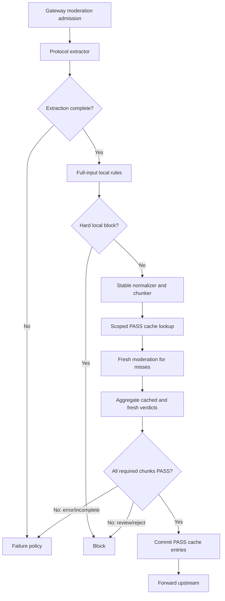

# Incremental Content Moderation Cache And Zhipu Adapter

**Date:** 2026-07-11

**Status:** Approved direction; ready for implementation planning

**Decision:** Add provider-aware moderation adapters and a short-lived, scoped PASS cache over stable overlapping text chunks. Every request still runs local deterministic checks over the complete extracted input. External moderation reuses cached PASS verdicts only for byte-equivalent normalized chunks under the same provider, model, audit scope, policy revision, and chunker version. New or changed chunks are moderated before upstream forwarding. Any incomplete extraction, missing verdict, provider error, `REVIEW`, or `REJECT` follows explicit fail-closed policy in pre-block mode.

This design supplements `2026-07-10-content-moderation-architecture-design.md`. Where the documents overlap, the architecture review's privacy, completeness, policy-versioning, and failure requirements remain authoritative.

## 1. Problem And Evidence

The external Zhipu moderation endpoint accepts at most 2,000 text characters per request. Real Codex Responses requests can be much larger and resend nearly all prior context on every turn.

One production `cyber_policy` sample reviewed for this design had:

- 166,049 raw JSON bytes;
- 159,703 Unicode code points in the serialized request;
- 64,745 normalized code points in message bodies;
- 35,481 normalized code points in user-role message bodies;
- 6,433 normalized code points in the last user message.

Moderating all message text with 1,800-character chunks and 200-character overlap requires about 41 external calls on the first pass. Moderating only the last user message requires four calls but misses changed developer/system content, tool arguments, tool results, and modified history. Repeating all 41 calls on every append-only turn is unnecessary.

The desired behavior is therefore:

1. scan all extracted text locally on every request;
2. externally moderate all text on the first complete request;
3. reuse exact PASS verdicts for unchanged stable chunks;
4. externally moderate only chunks affected by appended or modified content;
5. never treat truncation, cache failure, or a partial batch as PASS.

## 2. Scope

### In scope

- OpenAI-compatible and Zhipu moderation provider adapters.
- Stable Unicode text chunking with overlap.
- Incremental external moderation through a scoped Redis PASS cache.
- Complete-request aggregation across cached and fresh chunk verdicts.
- Pre-block and observe-mode failure semantics.
- Admin configuration and key-test support for the Zhipu provider.
- Metrics and logs for chunk counts, cache behavior, provider outcomes, and completeness.
- Focused backend and frontend tests.

### Out of scope

- Training a classifier from historical prompts.
- Automatically converting OpenAI `cyber_policy` records into blocking rules.
- Persisting additional full raw requests or prompt corpora.
- Audio or video moderation.
- A general remote moderation microservice.
- Semantic summarization of long prompts. Summaries are not a safety-preserving substitute for complete scanning.
- Fixing unrelated moderation architecture findings outside code paths required by this feature.

Existing OpenAI `cyber_policy` records may be used as an offline, access-controlled evaluation corpus. This implementation must not add new raw-body persistence or include user identity data in external moderation requests.

## 3. Options Considered

### Option A: Moderate all context on every request

This is simple and complete but repeatedly sends unchanged Codex history. The observed sample would require about 41 calls per turn. It increases latency, rate-limit pressure, cost, and sensitive-data transmission.

### Option B: Moderate only the latest user message

This reduces the observed sample to four calls, but it is unsafe. Client-supplied developer/system messages, tool results, function arguments, unknown roles, and changed history can all affect the upstream model.

### Option C: Stable chunks plus scoped PASS cache

This externally moderates the complete context on first use, then reuses exact PASS verdicts for unchanged chunks. Append-only turns usually invalidate only the previous tail chunk and create new tail chunks. Modified or reordered history changes downstream chunks and forces re-moderation. This option is chosen.

## 4. Safety Invariants

The implementation must preserve these invariants:

1. Local deterministic rules scan the complete extracted input on every request, independent of the external cache.
2. Only `PASS` external verdicts are reusable. Errors, timeouts, incomplete results, and unknown values are never cached.
3. A cache hit is valid only under the exact provider, moderation model, audit scope, policy revision, chunker version, and normalized chunk text.
4. Every required chunk must have a valid PASS verdict before a pre-block request can proceed.
5. Any `REVIEW` or `REJECT` is an explicit moderation hit. Trusted-group failure exceptions do not bypass explicit hits.
6. Extraction truncation or unsupported required text is not silently allowed in pre-block mode.
7. Redis failure disables reuse but does not disable moderation. The service calls the provider for all chunks.
8. Raw prompt text never appears in Redis keys, Redis values, metrics, or structured logs.
9. Cache entries are bounded by TTL and policy scope. There is no permanent global PASS allowlist.
10. The feature does not trust client-controlled Codex/Claude marker text as provenance.

## 5. Target Flow



Local rule evaluation remains before external cache lookup. A cached external PASS must never suppress a newly published local rule.

## 6. Components And Interfaces

### 6.1 Extracted input

The protocol extractor returns ordered sources and completeness metadata:

```go
type ModerationTextSource struct {
    Source string
    Role   string
    Text   string
}

type ModerationExtraction struct {
    Sources         []ModerationTextSource
    Complete        bool
    TruncateReasons []string
    TotalRunes      int
}
```

The extractor must not reconstruct a supposedly complete string after applying per-source limits. If any source or nested tool value exceeds a configured extraction budget, `Complete` is false and the reason is retained.

The implementation may adapt the existing `ContentModerationInput` instead of adding these exact public types, but the completeness contract and ordered source boundary must be explicit and testable.

### 6.2 Stable chunker

The chunker operates on the ordered normalized source stream, not serialized request JSON.

Defaults:

```text
max chunk runes: 1800
overlap runes: 200
stride: 1600
chunker version: zhipu-text-v1
max chunks per request: 64
```

Normalization for chunk identity uses Unicode NFKC, zero-width character removal, line-ending normalization, and whitespace compaction. The original normalized display text may preserve more structure for local rules, but cache identity must be deterministic.

Chunks are stable for append-only input:

- completed chunks never change when text is appended;
- the previous tail chunk may change until it reaches 1,800 runes;
- new text produces only new tail chunks;
- deleting, inserting, or changing earlier text changes affected and downstream chunks, forcing misses.

Source boundaries are represented by a fixed internal separator included in chunk identity and provider text. The separator must be constant, short, and not contain role or policy instructions. Overlap naturally carries text across message and tool boundaries.

Each chunk records non-sensitive source spans for diagnostics:

```go
type ModerationChunk struct {
    Index       int
    Text        string
    RuneCount   int
    SourceStart int
    SourceEnd   int
}
```

No chunk may exceed the provider's 2,000-character limit after final normalization. The 200-character margin is intentional.

### 6.3 Provider adapters

The external provider contract is provider-neutral:

```go
type ModerationLevel string

const (
    ModerationPass   ModerationLevel = "PASS"
    ModerationReview ModerationLevel = "REVIEW"
    ModerationReject ModerationLevel = "REJECT"
)

type ProviderModerationResult struct {
    Level      ModerationLevel
    RiskTypes []string
    Scores    map[string]float64
}

type ModerationProvider interface {
    ModerateText(ctx context.Context, model, apiKey, text string) (ProviderModerationResult, error)
}
```

The OpenAI adapter calls `/v1/moderations`. Existing configured score thresholds remain supported. `flagged=true` or any threshold hit maps to `REJECT`; otherwise the result maps to `PASS`. Empty results, unknown result shapes, or unknown categories that cannot be safely interpreted are errors rather than PASS.

The Zhipu adapter calls `/paas/v4/moderations` under `https://open.bigmodel.cn/api` by default, sends model `moderation`, and accepts only `PASS`, `REVIEW`, or `REJECT` from `result_list`. Empty lists, multiple contradictory text results, or unknown risk levels are errors.

Provider URL construction is adapter-owned. The admin `base_url` remains a provider base, not a complete endpoint:

```text
openai default base: https://api.openai.com
zhipu default base:  https://open.bigmodel.cn/api
zhipu endpoint:      /paas/v4/moderations
zhipu model:         moderation
```

### 6.4 Scoped PASS cache

The cache stores only successful PASS verdicts. The key is an HMAC, not a plain content hash:

```text
HMAC-SHA256(
  cache-key-secret,
  provider || 0x00 ||
  moderation-model || 0x00 ||
  audit-scope || 0x00 ||
  policy-revision || 0x00 ||
  chunker-version || 0x00 ||
  normalized-chunk-text
)
```

The HMAC secret is derived with domain separation from an existing server secret or supplied through a dedicated secret configuration. It must not be stored in policy JSON or exposed through admin APIs.

Redis key format:

```text
moderation:pass:v1:<hmac-hex>
```

The value contains only schema version and expiration metadata. Default TTL is 24 hours. TTL must be clamped to a safe server-defined range.

Batch behavior:

1. look up all chunk HMACs with one pipelined operation;
2. moderate misses with bounded concurrency;
3. aggregate all cached and fresh results;
4. write fresh PASS entries only if the complete request decision is PASS;
5. do not write partial PASS entries for a request that ends in review, reject, error, or incomplete extraction.

Redis read/write failures are metrics and logs, not moderation failures. Provider calls replace unavailable cache entries.

### 6.5 Batch executor

Defaults:

```text
worker concurrency: 4
per-call timeout: 3 seconds
whole-batch timeout: 8 seconds
per-chunk retries: 1
max chunks: 64
```

The executor uses the existing API-key health and rotation behavior, with a request-level call budget so retries cannot multiply without bound. `REJECT` may cancel outstanding work immediately. `REVIEW` may also cancel in pre-block mode because it is blocking, but observe mode may finish outstanding chunks to collect complete diagnostics.

Cancellation, rate limits, authentication errors, timeouts, malformed responses, and missing chunk results are typed errors. A partial batch is never aggregated as PASS.

### 6.6 Aggregator

Severity order is:

```text
REJECT > REVIEW > PASS
```

Pre-block behavior:

| Batch state | Decision |
|---|---|
| All required chunks PASS | Allow |
| Any REVIEW | Block as explicit moderation hit |
| Any REJECT | Block as explicit moderation hit |
| Any missing/error/incomplete result | Apply configured failure policy; public/default is fail-closed |

Observe mode records review/reject/error outcomes but does not block solely because of the external result. Local hard-deny rules retain their existing terminal semantics.

## 7. Configuration And Admin UI

Extend content-moderation configuration with:

```json
{
  "provider": "openai",
  "base_url": "https://api.openai.com",
  "model": "omni-moderation-latest",
  "pass_cache_ttl_seconds": 86400
}
```

Backward compatibility:

- missing `provider` means `openai`;
- existing base URL, model, API keys, thresholds, timeout, retry, mode, scope, group, and failure fields remain valid;
- switching provider changes default base/model only when the administrator has not supplied custom values;
- changing provider, model, scope, policy revision, or chunker version naturally invalidates reuse through cache-key scope.

The admin UI adds a provider select with `OpenAI` and `Zhipu`. Base URL and model placeholders follow the selected provider. Existing key testing uses the selected provider adapter and includes the same response validation as production calls.

Chunk size, overlap, concurrency, timeouts, maximum chunks, and chunker version remain server-owned constants in the first release. Exposing them as routine UI controls would make unsafe configurations too easy. PASS-cache TTL may be exposed only in an advanced section with server-side bounds.

All new user-visible text must be added to English and Chinese locale files.

## 8. Completeness And Oversized Requests

The current provider budget supports up to 64 chunks. With 1,800 runes and 200 overlap, this covers roughly 102,600 normalized runes.

When extraction is incomplete or more than 64 chunks are required:

- pre-block mode returns a typed moderation-unavailable/too-large decision and does not forward upstream;
- observe mode records the incomplete reason and may forward according to existing observe semantics;
- no PASS cache entries are written;
- metrics distinguish extraction truncation from chunk-budget overflow.

The service must not trim the suffix and present the request as fully audited.

## 9. Privacy And Feedback

The cache contains no raw text. Structured logs contain chunk counts, HMAC prefixes only when operationally necessary, provider/model, hit/miss counts, latency, risk level, and bounded risk-type values. They do not contain prompt text, email addresses, user IDs in provider payloads, API keys, URLs, or raw request slices.

OpenAI `cyber_policy` remains a post-upstream account-risk and evaluation signal, not proof that a particular cached chunk was unsafe. The system must not label every chunk in a blocked request as a positive example or automatically publish a rule.

This implementation may record a non-sensitive comparison event:

```text
request decision id
provider/model/policy revision
chunk count and cached/fresh counts
Zhipu aggregate level and bounded risk types
OpenAI cyber_policy=true
```

It must not expand raw-request retention. Historical raw records may be used in a separate, access-controlled offline evaluation process and must not be embedded in repository fixtures.

## 10. Observability

Add bounded-cardinality metrics:

- extracted source count and normalized rune count;
- chunk count and chunk-budget overflow;
- PASS cache hit, miss, read error, and write error;
- fresh provider call count, retry count, latency, and error class;
- aggregate PASS/REVIEW/REJECT/error decision;
- number of requests with OpenAI `cyber_policy` after a Zhipu PASS;
- batch cancellation and deadline exhaustion.

Runtime status reports the configured provider, model, cache availability, cache TTL, chunker version, and effective chunk limits without exposing keys or cache HMACs.

## 11. Rollout And Compatibility

1. Introduce provider adapters behind the current OpenAI behavior. Keep `provider=openai` as the default.
2. Add stable chunking with the cache disabled; verify complete aggregation and failure behavior in shadow/observe mode.
3. Enable the scoped PASS cache in observe mode and compare cached decisions against sampled fresh calls.
4. Enable Zhipu for an explicit group/model canary.
5. Enable pre-block only after cache equivalence, latency, error-rate, and `cyber_policy` false-negative metrics meet acceptance gates.

Rollback is configuration-only: switch the provider to OpenAI and disable PASS caching. Cache entries are naturally unreachable because provider and model are part of the key and expire within 24 hours.

No database migration is required for the initial configuration because moderation config is stored as version-tolerant JSON. Redis keys are additive and expire automatically.

## 12. Testing

### Chunker tests

- ASCII, Chinese, emoji, combining marks, and invalid/zero-width input.
- Exact 1,800, 1,801, and 2,000-character boundaries.
- Every chunk is at most 1,800 runes.
- Adjacent chunks overlap by exactly 200 runes when both are full.
- Append-only input preserves completed chunk identities.
- Insert/delete/reorder invalidates affected downstream chunks.
- Text split across message/tool boundaries appears in overlapping chunks.
- More than 64 chunks returns incomplete instead of truncating.

### Cache tests

- Exact repeated chunks hit.
- Provider, model, scope, policy revision, or chunker-version changes miss.
- Plain prompt text never appears in Redis keys or values.
- Redis read failure causes provider calls.
- Redis write failure does not change a PASS decision.
- Partial/rejected/error batches write no PASS entries.
- TTL is present and bounded.

### Provider tests

- OpenAI path, payload, flagged handling, score thresholds, empty results, and unknown shape.
- Zhipu path `/paas/v4/moderations`, model `moderation`, Bearer auth, and PASS/REVIEW/REJECT parsing.
- Zhipu empty list, unknown risk level, HTTP error, timeout, and conflicting results fail safely.
- Payload text never exceeds 1,800 runes.

### Service tests

- Local rules execute despite full PASS-cache coverage.
- First 64,745-character request moderates every chunk.
- Repeated request uses cached PASS entries.
- Appending a 6,433-character user message moderates only changed/new tail chunks.
- Changed historical content invalidates downstream chunks.
- REVIEW and REJECT block in pre-block mode.
- Missing/error/incomplete results obey fail-closed semantics.
- Observe mode records without external-result blocking.
- Concurrent requests do not race cache or API-key health state.

### Frontend tests

- Provider selection applies safe defaults without overwriting saved custom values.
- Zhipu placeholders and localized descriptions render.
- API-key test sends provider/base/model correctly.
- Existing OpenAI configurations remain unchanged after load/save.

## 13. Acceptance Criteria

The feature is complete when:

1. Zhipu can be configured with base URL `https://open.bigmodel.cn/api` and model `moderation` and passes the admin key test.
2. No outbound Zhipu text payload exceeds 1,800 Unicode code points.
3. A complete first request externally moderates every required chunk or fails closed.
4. An unchanged repeated request performs zero external calls after PASS cache population.
5. Appending text performs external calls only for changed/new tail chunks while retaining cross-boundary overlap.
6. Changing provider/model/scope/policy/chunker version causes cache misses.
7. Redis unavailability never causes a moderation bypass.
8. REVIEW, REJECT, malformed provider responses, and incomplete batches cannot become PASS.
9. No raw prompt text, API key, email address, or user identifier is stored in the PASS cache or emitted in new logs.
10. Focused backend tests, race tests for the new executor/cache, frontend tests, lint, typecheck, and builds pass.

## 14. Residual Risks

- A 200-character overlap cannot guarantee detection of every long-range semantic combination. The provider's 2,000-character limit makes this unavoidable; local full-input rules and upstream feedback remain necessary.
- Provider policy changes within the 24-hour PASS TTL can make cached verdicts temporarily stale. Policy/model/chunker changes invalidate cache scope, and the TTL bounds exposure.
- The first large request remains expensive and can add latency. Incremental reuse improves repeated Codex turns but does not remove first-pass cost.
- Historical OpenAI `cyber_policy` labels may include false positives and are request-level rather than chunk-level labels. They require human review before influencing rules.
