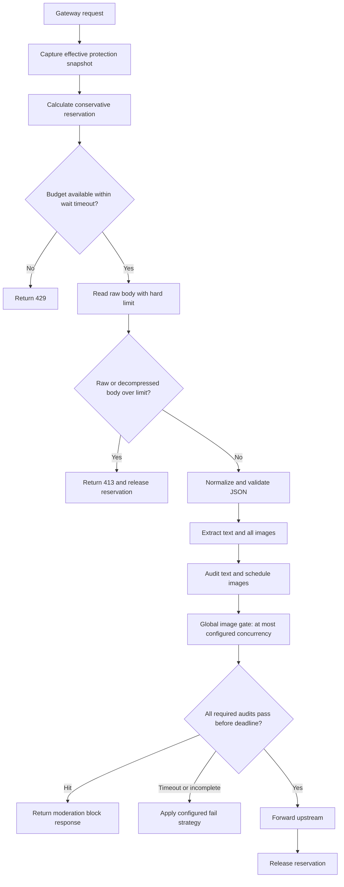

# Large Image Request Memory Protection

**Date:** 2026-07-11

**Status:** Specification reviewed and approved; ready for implementation planning

**Decision:** Keep image count unlimited, cap each decompressed gateway request body at 50 MiB by default, admit requests through a global weighted in-flight memory budget, and audit images through a global concurrency gate of five. All application protection values are editable in the admin risk-control page and apply to new requests without restart. Deployment-level container memory and swap remain separate safeguards.

## 1. Problem

Production entered host-level memory pressure between 15:51 and 15:55 on a 3.4 GiB host with no swap. The incident window contained repeated large `/responses` requests, including a 25.3 MiB body and a request with 78 images. The gateway reads the complete body, normalizes JSON, extracts moderation input, and builds external moderation payloads. These stages can retain multiple representations of the same image data, so resident memory can be several times the HTTP body size.

A per-request size limit alone is insufficient. Several individually valid 50 MiB requests can still enter together and exhaust the host. Conversely, an image-count limit rejects legitimate requests containing many small images and does not protect against one very large image.

The required behavior is:

1. do not impose an image-count limit;
2. reject request bodies larger than a configurable limit, default 50 MiB after decompression;
3. bound aggregate memory pressure from concurrent request parsing and moderation;
4. globally limit concurrent image moderation calls, default five;
5. expose all application-level protection values in the admin risk-control page;
6. preserve availability of normal, small requests during bursts of large image requests.

## 2. Scope

### In scope

- Every HTTP or WebSocket gateway route that reads a complete client request or message body, including OpenAI-compatible, Anthropic, Gemini, image, and batch-image routes.
- A size-limited request-body reader for identity and compressed bodies.
- A global weighted admission controller for in-flight request bodies.
- Unlimited image extraction followed by bounded image moderation scheduling.
- Dynamic admin configuration, validation, runtime status, metrics, logs, and localized UI labels.
- Focused backend and frontend tests plus memory-oriented load verification.

### Out of scope

- Changing clients to upload images to object storage.
- Persisting request bodies or images for queue-based asynchronous moderation.
- Guaranteeing that the process can never be terminated under arbitrary unrelated memory growth. Host protection requires deployment limits in addition to application controls.
- Making Docker memory limits, `GOMEMLIMIT`, or host swap editable from the application UI.

## 3. Options Considered

### Option A: Per-request 50 MiB limit only

This rejects a single oversized request but allows many valid 50 MiB requests to be read concurrently. Body normalization and moderation payload serialization can multiply memory use. This does not address the observed failure mode and is rejected.

### Option B: Request limit plus weighted admission and bounded moderation

Each request reserves a conservative memory charge before its complete body is read. New requests wait briefly or receive `429` when the global budget is full. Image moderation uses a separate global concurrency gate and a per-request deadline. This preserves the existing API and bounds the image-request contribution to memory pressure. This option is selected.

### Option C: Spool request bodies to disk and stream all parsing

Disk spooling can reduce heap residency further, but the current handlers, protocol extractors, moderation service, request rewriting, retry logic, and forwarding adapters depend on `[]byte`. Converting the complete path to streaming is a larger compatibility-sensitive refactor. It remains a future option if measured memory amplification exceeds the selected budget model.

## 4. Configuration

Add the following fields to the existing content-moderation configuration and expose them under a new resource-protection section in the risk-control page:

| Field | Default | Allowed range | Meaning |
| --- | ---: | ---: | --- |
| `max_request_body_mib` | 50 | 1-256 | Maximum raw and decompressed gateway request body size |
| `inflight_memory_budget_mib` | 400 | 64-4096, further capped by runtime memory envelope | Total weighted request-memory reservations allowed in one process |
| `request_memory_multiplier` | 4 | 2-8 | Conservative charge multiplier applied to request bytes |
| `minimum_request_charge_kib` | 256 | 64-4096 | Minimum body size used for weighted charging, covering per-request overhead |
| `small_request_threshold_mib` | 1 | 1-8 | Maximum declared uncompressed size eligible for reserved small-request capacity |
| `small_request_reserve_mib` | 64 | 16-512 | Portion of the total weighted budget unavailable to large requests |
| `admission_wait_timeout_ms` | 5000 | 0-60000 | Maximum wait for memory budget; zero rejects immediately |
| `image_audit_max_concurrency` | 5 | 1-32 | Maximum image moderation calls active across the entire process |
| `request_audit_timeout_ms` | 30000 | 1000-300000 | Total moderation deadline for one gateway request |

There is deliberately no `max_image_count` field.

MiB means exactly `1024 * 1024` bytes and KiB means exactly `1024` bytes. Values are persisted in the existing `content_moderation_config` setting. Missing fields from older JSON receive defaults during normalization. Saving configuration validates ranges with overflow-safe integer arithmetic and requires `minimum_request_charge_bytes <= max_request_body_bytes`, `small_request_reserve_bytes < inflight_memory_budget_bytes`, and `max_request_body_bytes * request_memory_multiplier <= inflight_memory_budget_bytes - small_request_reserve_bytes`. The effective budget must also fit within the runtime safe envelope described in Section 10; values outside that envelope are rejected rather than merely warned about.

The service owns one `ResourceProtectionManager`, containing the immutable configuration snapshot, process-wide weighted admission controller, and process-wide image scheduler behind one synchronization boundary. A separate update mutex serializes the entire admin update transaction from candidate load through validation, persistence, and runtime publication, so concurrent admin saves cannot reorder database and runtime state. A successful update acquires that mutex, validates and persists the complete candidate, then acquires the manager write lock, updates both existing controllers in place, publishes the snapshot as the final runtime linearization point, and releases both locks before returning success. Admission captures its snapshot and registers or queues its reservation through one manager operation under the manager lock; waiting happens after registration without retaining the lock. It therefore observes either the complete old state or complete new state, never a mixed state. Controller instances are never replaced during a live update. If persistence fails, runtime state is unchanged. Controller updates and publication cannot fail after validation. If the process stops between persistence and runtime publication, startup loads the persisted value before accepting traffic and applies the startup policy in Section 10.

Each request captures body limit, multiplier, admission timeout, and audit timeout when it enters admission; those values remain fixed for that request. Budget and image-concurrency limit changes affect new grants immediately. Lowering a limit never cancels admitted work: the controller stops new grants until usage falls below the new limit. Existing image calls finish, while queued image work obeys the lower limit. Raising a limit wakes eligible waiters. Configuration changes apply without restart.

The admin UI shows MiB and milliseconds as human-readable numeric inputs. It also states current effective values, active reservations, waiting requests, and active image audits. User-visible text is added to both Chinese and English locales.

## 5. Request Flow

Reservation release is registered immediately after successful acquisition and runs on every exit path, including client cancellation, parse failure, moderation block, timeout, upstream error, and panic recovery.

Body admission and strict size limits run before the moderation feature guard. They remain active when moderation is disabled, configured `off`, out of group/model scope, missing a provider key, or operating fail-open. A generated route-coverage manifest lists every handler and WebSocket message path that reads a complete body; a structural test fails when such a route lacks resource-protection admission.

## 6. Weighted Admission

### 6.1 Initial reservation

The admission controller uses bytes internally. Before reading the full body:

- for an uncompressed request with a valid positive `Content-Length`, reserve `max(Content-Length, minimum charge) * multiplier`, capped by the maximum body charge;
- for chunked, unknown-length, compressed, or otherwise ambiguous requests, reserve `max body * multiplier`;
- if declared `Content-Length` already exceeds the body limit, return `413` without acquiring budget or reading the body.

With defaults, a maximum-size request reserves 200 MiB, and even an empty or tiny admitted request reserves at least 1 MiB after the 256 KiB minimum and multiplier are applied. The controller reserves 64 MiB of the 400 MiB budget for requests whose declared uncompressed size is at most 1 MiB. Large requests can use the remaining 336 MiB, so one maximum-size request is admitted while normal small traffic retains capacity. Unknown-length and compressed requests use the large-request pool.

After the raw body is read, normalization performs a no-allocation sizing pass. The required charge is `max(raw bytes, decompressed bytes, normalized bytes) * multiplier`. Before decompression or normalization allocates its output, the request must already hold that charge. Ambiguous and compressed requests reserve the configured maximum charge from the start. A known uncompressed request may attempt a non-blocking reservation upgrade after the sizing pass; if the upgrade is unavailable, it returns `429` and releases its original reservation without allocating the expanded output. It may reduce excess reservation only after all larger intermediate buffers have been dropped. Accounting never occurs after allocation.

### 6.2 Fairness and cancellation

Reservations are granted in arrival order within the small and large classes. Waiting observes both request-context cancellation and `admission_wait_timeout_ms`. Timeout returns `429 Too Many Requests` with `Retry-After: 1`. Small requests draw from their reserved capacity first and may use currently available general capacity. Large requests never borrow the small reserve. Once a large request is waiting, additional small requests beyond the reserve do not jump ahead of it for general capacity. Tests must show that sustained large traffic cannot starve small requests and sustained small traffic cannot permanently starve an older large waiter.

The weighted controller supports runtime limit changes as defined in Section 4. It maintains one authoritative active-byte count across changes.

### 6.3 What the budget guarantees

The budget bounds memory attributed to full request bodies using a conservative multiplier; it is not a measurement of process RSS. The multiplier covers the raw body, normalized body, extracted strings, and moderation payload serialization. Load testing must verify that the default factor of four is conservative for the production request shapes. If it is not, the default is raised before deployment.

## 7. Strict Body Limits

The shared body reader must enforce limits while reading, not after `io.ReadAll` completes.

- Identity bodies are read through a `limit + 1` reader so overflow is detected.
- Compressed input has both the configured raw compressed limit and the configured decompressed limit.
- gzip, deflate, and zstd decompression also read `limit + 1`; reaching the extra byte returns a typed maximum-body error.
- Lenient JSON normalization uses the same configured limit and cannot create output beyond it.
- A body-limit violation maps consistently to `413`, not a generic parse or internal error.
- Stacked or unsupported `Content-Encoding` values return `415`; malformed compressed streams return `400`.
- On HTTP/1.1 overflow, the server stops reading and marks the connection for close instead of draining an attacker-controlled body. On HTTP/2 it cancels the request stream without closing unrelated streams.
- Raw compressed bytes remain charged until decompression output is complete and the raw buffer is no longer referenced.

The limit applies to the entire request JSON, including Base64 image data. Remote image URLs contribute only their URL bytes; the gateway does not download those images locally as part of admission.

## 8. Image Moderation

All extracted images are logically required moderation inputs. The existing one-image truncation must not silently allow later images to bypass review.

The first implementation uses individual image moderation calls; provider-specific batching is deferred. A process-wide scheduler owns five long-lived workers by default. Each admitted request may expose at most one pending image item to the scheduler. The scheduler rotates active requests in round-robin order, so one many-image request cannot continuously reacquire all slots while another request is waiting. Producers block at the one-item boundary and stop on request cancellation. The scheduler queue is bounded by the number of admitted requests, not image count; the implementation must not start one goroutine per image or materialize a second unbounded image queue.

Text moderation runs once through the existing path. Every image is moderated through an individual call in the first implementation, with these aggregation rules:

- any explicit image hit cancels remaining work and blocks the request;
- every image must receive a PASS result before a pre-block request proceeds;
- provider errors, context cancellation, or expiration of `request_audit_timeout_ms` produce an incomplete result and follow the configured fail strategy;
- observe mode may forward according to its existing semantics but records the incomplete audit;
- no image body, Base64 data, or URL query string is written to logs or metrics.

The request audit deadline starts when moderation begins, after body validation and extraction, and includes text audit, scheduler waiting, image calls, retries, and aggregation. Outcome precedence is deterministic: client cancellation terminates processing and never forwards; among completed audit results an explicit hit wins; otherwise timeout or provider/incomplete error follows fail strategy; only complete PASS forwards. Every external call receives the request audit context and closes its response body.

Cancellation alone is not completion. Each request owns a task-completion group that counts dispatched image tasks, not scheduler workers. Every task releases its image slot in `defer`, drops body-derived payload references, converts panic to an incomplete result, and acknowledges the request group. After cancellation or normal completion, the request waits for every dispatched task acknowledgment before releasing its weighted body reservation. The global scheduler workers remain alive. Tests include providers that delay cancellation and tasks that panic.

Unlimited image count does not mean unlimited processing time. A request containing thousands of tiny images is bounded by the 50 MiB body limit, concurrency gate, and total audit deadline. In pre-block fail-closed mode it is rejected if all images cannot be audited in time.

## 9. Errors And Compatibility

| Condition | HTTP behavior | Stable error code |
| --- | --- | --- |
| Declared, raw, normalized, or decompressed body exceeds limit | `413` | `request_body_too_large` |
| Admission budget unavailable before timeout | `429` with `Retry-After` | `request_memory_budget_exhausted` |
| Explicit moderation hit | Existing configured block status | Existing moderation block code |
| Audit deadline or incomplete image result | Existing fail strategy | `content_moderation_incomplete` when blocked |

Existing clients below the configured limit require no protocol changes. No image-count-specific error is introduced.

WebSocket routes apply protection per client message. They use a streaming message reader with `limit + 1` detection before full allocation; per-message compression is limited on decompressed bytes and reserves the maximum charge before decompression. A reservation lives until that message has completed moderation and forwarding and all of its dispatched tasks have acknowledged completion and dropped payload references. Oversize messages receive WebSocket close code `1009`; admission exhaustion receives a protocol error frame when supported followed by close code `1013`; malformed messages use the route's existing protocol error. Equivalent safety semantics are required, not HTTP status codes. Route-coverage tests prevent an unprotected alternate HTTP or WebSocket path.

## 10. Runtime Safeguards

Application controls reduce expected heap pressure but do not isolate PostgreSQL and Redis from an unexpected process regression. Production rollout requires:

- `sub2api` container memory limit: approximately 2 GiB on the current host;
- `GOMEMLIMIT=1500MiB` as the initial Go soft memory limit;
- 2-4 GiB host swap as an emergency buffer.

These values are deployment configuration, not admin settings. The container limit protects the host; `GOMEMLIMIT` encourages earlier garbage collection; swap prevents a short spike from immediately making the host unresponsive. Swap is emergency resilience and is not counted as application capacity.

At startup, the service reads the effective cgroup memory limit and Go memory limit. The maximum accepted in-flight budget is the lower of 50% of the cgroup limit and two-thirds of `GOMEMLIMIT`; if neither limit is finite, the conservative maximum is 1 GiB. The admin API and UI expose this safe maximum and reject larger budgets. For the proposed 2 GiB cgroup and 1500 MiB `GOMEMLIMIT`, the runtime ceiling is 1000 MiB, so the 400 MiB default is valid.

Startup validates the persisted configuration against the current runtime envelope before accepting traffic. If the envelope is at least the minimum supported 64 MiB but the persisted/default configuration no longer fits, the service activates a deterministic safe fallback without overwriting the persisted value: budget is `min(400 MiB, runtime ceiling)`, small reserve is `min(64 MiB, budget / 4)` but never below 16 MiB, multiplier is four, and maximum body size is `min(50 MiB, floor((budget - reserve) / multiplier))`. The remaining protection fields use their documented defaults. The status and admin APIs return both configured and effective values plus a degraded warning, and a valid admin save replaces both persisted and effective state. If the runtime ceiling is below 64 MiB or the derived fallback cannot satisfy the minimum ranges, startup fails before opening listeners with an actionable resource-protection error. The service never starts with an unsafe oversized persisted budget.

Before rollout, measure peak PostgreSQL, Redis, OS, and Sub2API memory under representative traffic. At least 512 MiB host `MemAvailable` must remain during the controlled load run. Deployment changes restart only the `sub2api` service and must not recreate PostgreSQL or Redis data volumes.

## 11. Observability

Add counters and gauges for:

- body-limit rejections by route and protocol;
- admission attempts, waits, wait timeouts, active bytes, configured budget, and queue length;
- body bytes and charged bytes per admitted request;
- extracted image count per request as a numeric metric only;
- active image audits, configured concurrency, completed audits, failures, hits, and timeouts;
- total moderation duration and incomplete-audit outcomes.

Structured logs include request ID, route, protocol, body bytes, charged bytes, image count, wait duration, and outcome. They exclude request bodies, image data, and credentials. Runtime status exposes effective limits and current usage so administrators can distinguish body-limit rejection, admission pressure, and provider slowness.

## 12. Testing And Acceptance

### Backend unit tests

- identity, chunked, gzip, deflate, and zstd bodies at limit, one byte over limit, and decompression expansion over limit;
- typed body-limit errors map to `413` on all shared gateway paths;
- admission acquisition, FIFO waiting, timeout, cancellation, release on every exit, and live budget changes;
- 50 MiB requests reserve 200 MiB under default settings and only one fits in the 336 MiB large-request portion of a 400 MiB budget;
- global image concurrency never exceeds five across multiple requests;
- all images are audited, a hit cancels remaining work, and timeout cannot be treated as PASS;
- legacy moderation JSON receives defaults and updated values round-trip through admin APIs;
- invalid ranges return `400` without partially updating configuration.

### Frontend tests

- the risk-control page loads, validates, edits, and saves every protection value;
- Chinese and English labels and validation messages exist;
- effective values and the runtime-safe maximum render without layout overflow.

### Load verification

Run the service for at least 15 minutes per workload with the intended 2 GiB container limit and `GOMEMLIMIT=1500MiB`; repeat burst scenarios at least 100 times:

1. send sustained normal text traffic while one 50 MiB image request is active;
2. send a second 50 MiB request and verify the 64 MiB small-request reserve remains available; verify it waits then receives `429` if large capacity is not released;
3. send compressed input that expands past 50 MiB and verify early `413`;
4. send many small images within 50 MiB and verify global image concurrency remains five and audit timeout is enforced;
5. cancel clients during admission, body read, and image audit and verify reservations return to zero;
6. exercise normalization-expanding bodies and repeated cancellation while provider stubs delay cancellation;
7. lower and raise budget and image concurrency repeatedly while work is active;
8. run equivalent compressed and oversized WebSocket messages;
9. sustain small-request traffic throughout every large-request workload;
10. record cgroup `memory.current`, `memory.peak`, `memory.events`, process RSS, Go heap, host `MemAvailable`, PostgreSQL health, and Redis health.

Acceptance requires:

- no host-level memory-pressure event or service-host reboot during the load run;
- zero cgroup `oom` and `oom_kill` events;
- cgroup `memory.peak` remains below 90% of the 2 GiB limit;
- within two minutes after traffic stops and one forced test-only GC, process RSS returns to the larger of baseline plus 200 MiB or 120% of baseline;
- host `MemAvailable` remains at least 512 MiB;
- PostgreSQL and Redis remain responsive;
- small-request p95 latency increases by no more than 25% from the pre-test baseline and has no admission failures while reserved capacity is available;
- every protected route returns consistent `413`, `429`, and moderation failure behavior.

## 13. Rollout

1. Deploy backend and frontend support with conservative defaults.
2. Apply and verify the container memory limit, `GOMEMLIMIT`, and swap before enabling production load.
3. Verify effective runtime settings and zero leaked reservations.
4. Run controlled large-request tests, then observe one traffic peak.
5. Tune the admin-configurable budget, multiplier, concurrency, wait timeout, and audit timeout from measured RSS and provider latency.

Rollback restores the previous application image and Compose service configuration. Database schema changes are not required because the values live in the existing settings JSON.
